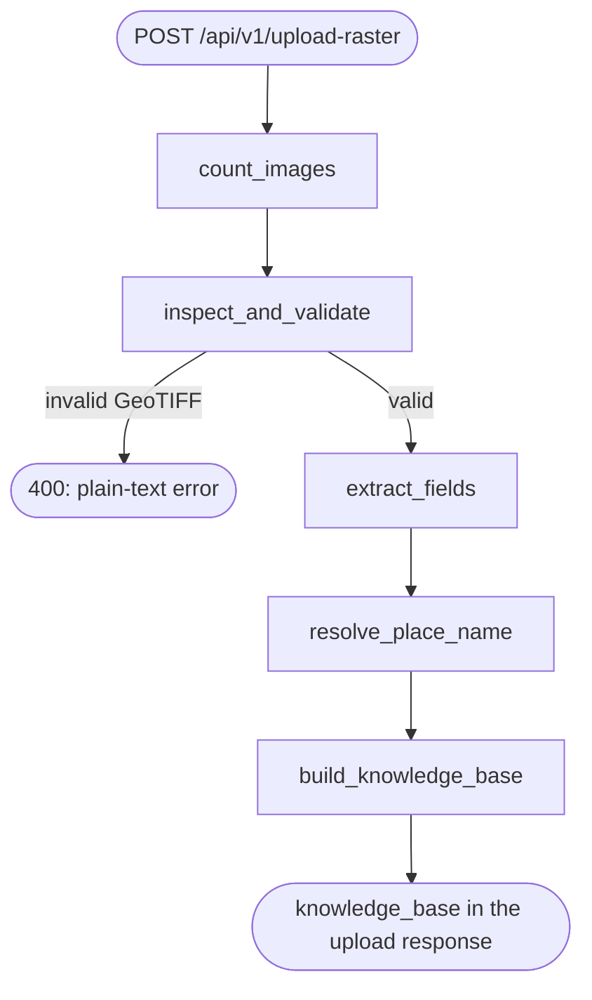
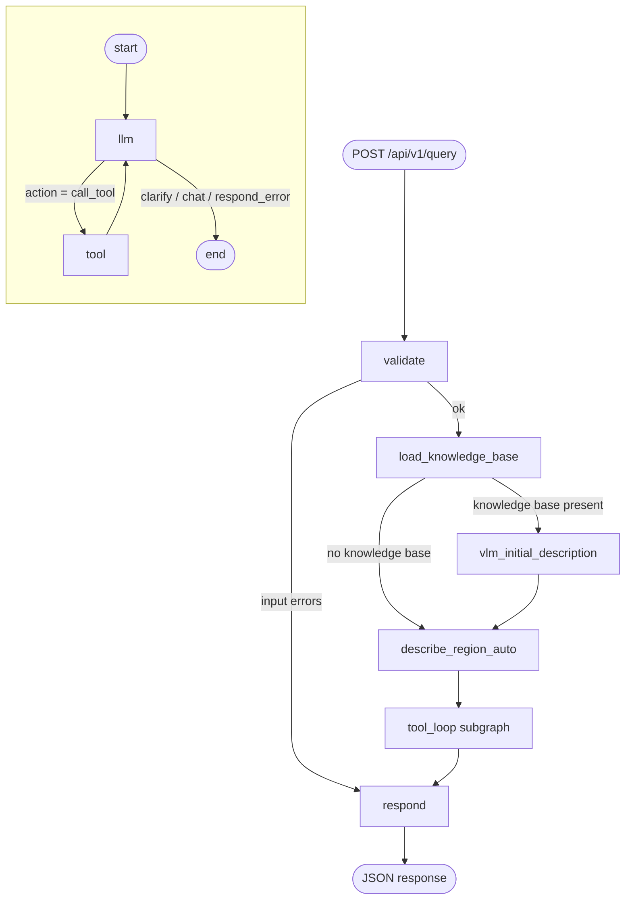

# SatQuery: Production Geospatial AI & Earth Observation Intelligence Suite

[](https://opensource.org/licenses/MIT)
[](https://www.python.org/)
[](https://nodejs.org/)
[](https://rasterio.readthedocs.io/)
[](https://dataspace.copernicus.eu/)
[](https://docs.docker.com/compose/)

## What is SatQuery, in plain English?

SatQuery answers natural-language questions about a piece of land using real satellite
data. You ask something like *"Map wildfire burn severity for this area"* or *"Compute
NDVI for this GeoTIFF"*, and SatQuery:

0. **Understands the image the moment you upload it** — `POST /api/v1/upload-raster`
   validates the file is actually a readable GeoTIFF (not just a `.tif` extension),
   extracts its bands, centroid lat/long, and (once you wire in a geocoding backend) a
   place name, and hands all of it back as a small per-image **knowledge base** —
   before you've even asked a question (see §2).
1. **Understands the request** — a planner (either a simple keyword matcher, or a real
   LLM like GPT-5.2 or Claude Sonnet 5) figures out which scientific tool(s) the
   request needs, and can call more than one tool in sequence — gathering grounding
   facts or recovering from a failed call — before answering (see §2).
2. **Fetches or reads the data** — pulls fresh Sentinel-1/Sentinel-2 satellite imagery,
   ERA5 historical *or live/forecast* weather data from public APIs, or reads a GeoTIFF
   file you already have.
3. **Runs the science** — vegetation indices, change detection, land-cover/terrain
   analysis, burn severity, flood mapping, drought stress — all deterministic,
   unit-aware numerical computation (no LLM guessing at numbers).
4. **Looks at the picture** — if you uploaded an image, a vision-language model (VLM)
   describes it up front, grounded in the knowledge base from step 0, before any further
   tool is even considered. The same VLM can also mark/locate a specific region with an
   approximate bounding box, or qualitatively compare two images that aren't grid-
   aligned — via an API (OpenAI) or a model running entirely on your own machine
   (InternVL / EarthMind).
5. **Answers you** — either a templated summary, or (if an LLM orchestrator is
   configured) a short narrative answer synthesized from the actual numbers.

There are three ways to run it: a **web UI** (React), a **REST API** (FastAPI), and a
**Model Context Protocol (MCP) server** for Claude Desktop / other MCP clients. All
three sit on top of the same 11 science tools and the same LangGraph orchestrator.

Everything that could change between machines or deployments — which LLM to use, which
vision model to use, API keys, ports, CORS origins, output directories — is an
environment variable with a documented default. Nothing is hardcoded.

---

## Table of contents

1. [Architecture at a glance](#1-architecture-at-a-glance)
2. [The agent flow graph (how one request is processed)](#2-the-agent-flow-graph-how-one-request-is-processed)
3. [Model roles: what LLMs and VLMs are supported](#3-model-roles-what-llms-and-vlms-are-supported)
4. [Configuration reference (every env var, every default)](#4-configuration-reference-every-env-var-every-default)
5. [Repository map](#5-repository-map)
6. [The 11 science tools + the vision tools](#6-the-11-science-tools--the-vision-tools)
7. [Multi-tool missions (Pipelines A/B/C)](#7-multi-tool-missions-pipelines-abc)
8. [HTTP API reference](#8-http-api-reference)
9. [The frontend (chat UI)](#9-the-frontend-chat-ui)
10. [Running the project](#10-running-the-project)
11. [Testing](#11-testing)
12. [Security notes](#12-security-notes)
13. [License & citation](#13-license--citation)

---

## 1. Architecture at a glance

```text
┌──────────────────────────────────────────────────────────────────────────────┐
│                        BROWSER (React chat UI, §9)                           │
│   frontend/  — nginx (Docker) or `vite dev` (native), port 3000              │
│   Talks to the backend over HTTP; the API base URL is injected at container  │
│   start (env-config.js), never baked into the build.                        │
└───────────────────────────────────┬────────────────────────────────────────┘
                                     │  POST /api/v1/query(/stream), POST /api/v1/
                                     │  upload-raster (validates + builds a per-
                                     │  image knowledge base), GET /api/v1/
                                     │  raster-preview, GET /api/v1/models, /health
                                     ▼
┌──────────────────────────────────────────────────────────────────────────────┐
│                      BACKEND — FastAPI + LangGraph (port 8000)               │
│                                                                              │
│  backend/orchestrator/  — the "brain": upload → ingest_graph builds a       │
│                            knowledge base; query → validate → VLM first     │
│                            look → tool_loop → respond (see §2). Two         │
│                            independent, swappable model roles live here:    │
│      • Orchestrator role  — picks the next tool, optionally writes the      │
│                              final narrative answer. mock | openai | anthropic│
│      • Vision-tool role   — analyze_imagery_vlm, called like any other tool  │
│                              to interpret a rendered image. openai | local   │
│                                                                              │
│  backend/tools/executor.py — dispatches to the 11 science tools below, the  │
│                               vision tool, and the 3 mission pipelines       │
└───────┬───────────┬───────────┬───────────┬──────────────┬──────────────┬────┘
        │           │           │           │              │              │
        ▼           ▼           ▼           ▼              ▼              ▼
   Tool_1..3    Tool_4       Tool_5..8   Tool_9..11     backend/vision/ backend/rendering/
   (Sentinel    (Open-Meteo  (offline    (Web Intel,    (OpenAI vision  raster_preview.py
   Hub API)     ERA5, no     NumPy /     POI, Affine    API OR HTTP     (GeoTIFF → PNG,
                API key)     rasterio)   Math engines)  to local VLM)   shared viewer)
                                                               │
                                                               ▼
                                                   ┌───────────────────────────┐
                                                   │  local_model_server/       │
                                                   │  (separate FastAPI service,│
                                                   │  optional Docker Compose   │
                                                   │  profile "local-models")   │
                                                   │  Serves InternVL-1B OR     │
                                                   │  EarthMind-4B via          │
                                                   │  transformers, port 8080   │
                                                   └───────────────────────────┘
```

Three independent containers (backend, frontend, and the optional local-model
sidecar) plus a completely offline core of the science tools (5–8 and 11 never touch the
network) is the whole system. Nothing about which LLM/VLM is active changes any of
this — it's all env-var configuration read once at process startup.

---

## 2. The agent flow graph (how one request is processed)

The backend is two [LangGraph](https://langchain-ai.github.io/langgraph/) state
machines, not one: a small **ingestion graph** that runs once per uploaded file, and
a **query graph** that runs once per `POST /api/v1/query`. Both are graphs of Python
functions ("nodes") passing a shared state dict ("clipboard") between each other.

### 2.1 Upload time — `ingest_graph.py`

Runs synchronously inside `POST /api/v1/upload-raster`, before the endpoint even
returns:



| Node | What it does |
| :--- | :--- |
| **count_images** | Bookkeeping only — the endpoint accepts one file per call, so this is always `1`; pair-mode uploads are just two separate calls, each building its own knowledge base. |
| **inspect_and_validate** | Runs `inspect_geotiff_metadata` (Tool 6) on the saved file. This doubles as the validation step — if the file can't actually be opened as a raster (e.g. a renamed non-TIFF), Tool 6's own `rasterio.open()` failure surfaces here as `status: "error"`, and the endpoint returns the plain-text `"Please enter a valid GeoTIFF/TIFF file."` |
| **extract_fields** | Pulls the band names and derives a centroid `latitude`/`longitude` from the file's own georeferenced bounds (`registry.py::derive_grounding_fields`). |
| **resolve_place_name** | Calls `get_place_name_from_coordinates` (`backend/tools/geocode.py`, backed by Tool 10's reverse geocoding — see §6) to turn the centroid into a place name. Failing here (e.g. no network) degrades gracefully: `place_name: null`, upload still succeeds. |
| **build_knowledge_base** | Assembles `{file_path, bands, latitude, longitude, place_name}`, writes it to disk next to the raster as `<same-stem>.kb.json`, and returns it in the upload response. |

### 2.2 Query time — `graph.py`



| Node | What it does |
| :--- | :--- |
| **validate** | Checks the query isn't empty and that `bbox` / `latitude` / `longitude` are well-formed. Any problem here short-circuits straight to `respond` with an error. |
| **load_knowledge_base** | If `input_file` is set, loads the sibling `<stem>.kb.json` written at upload time (§2.1) onto the state. No file present → `knowledge_base: null`, nothing else changes. |
| **vlm_initial_description** | Only runs when a knowledge base was found. Calls `analyze_imagery_vlm` with the query *plus* the knowledge base serialized as context, so the very first thing the model does is describe the image grounded in its real bands/location — not guess at them. The result is recorded both as `initial_description` and as the loop's first `tool_results` entry. |
| **describe_region_auto** | Always runs (regardless of whether a knowledge base was found). No-ops unless a region was marked (`region_bbox` set) — see §6/§9 — in which case it deterministically crops the raster to that exact bbox, describes it, and reverse-geocodes its center, recording the result as a `tool_results` entry before the planner is even consulted. Made deterministic (not a planner choice) after observing the planner sometimes decide an existing whole-image description or earlier conversation turn already covered a *newly* marked region, silently skipping it. |
| **tool_loop** (`tool_loop_graph.py`) | A separate compiled subgraph, embedded as a single node — see below. Decides, one hop at a time, whether another tool call is needed. |
| **respond** | Builds the final `status` + `final_answer` — either a templated string, or (when the orchestrator role is a live LLM) a short narrative synthesized from the tool output and the initial VLM description. |

**The `tool_loop` subgraph** is the recursive `start → llm → tool → end` loop: `llm`
consults the planner (mock keyword matcher or a live LLM, §3) for exactly one action;
if it's `call_tool`, `tool` runs it with backend-computed ("trusted") arguments — the
LLM only ever picks *which* tool, never fabricates coordinates, dates, thresholds, or
file paths — and loops back to `llm` with the result folded into state. Any other
action (`clarify`/`chat`/`respond_error`) ends the subgraph immediately and falls
through to the outer `respond` node. This loop is capped at **10 tool hops**
(`MAX_TOOL_HOPS` in `tool_loop_graph.py`) so a runaway plan can never spin forever.

This replaces an earlier design where a deterministic, hand-coded "agenda" drove
multi-step missions/chains. Every request — single-tool, chained, or a named mission
like wildfire/flood/drought — now goes through the same generic loop, with the LLM
deciding each hop for itself, guided by routing hints in `llm.py` (e.g. "a wildfire
request needs pre/post multispectral imagery and LULC before calling
`workflow_wildfire_burn_severity` — fetch what's missing first"). This is simpler and
more uniform, but it does mean mission sequencing is only as reliable as the planner's
own reasoning — see §7's note on this trade-off. The mock/keyword planner used in tests
(`SATQUERY_ORCHESTRATOR_PROVIDER=mock`) compensates for having no real reasoning by
never re-selecting a tool it has already attempted in the same request, so it still
terminates deterministically; it just can't chain *distinct* tools the way a real LLM
can.

A successful `inspect_geotiff_metadata` call also writes its derived `bbox` (and a
centroid `latitude`/`longitude`) back onto the shared state if nothing more specific
was already provided (`registry.py::derive_grounding_fields`) — so a later hop in the
same request (e.g. `fetch_weather_environment`, or a fetch tool that was only missing
a bbox) can use a location the request never explicitly gave it, derived instead from
a file's own georeferencing.

---

## 3. Model roles: what LLMs and VLMs are supported

SatQuery has **two independent, separately configurable "model roles."** Neither one
automatically fails over to the other at runtime — which backend is active for each
role is a **static choice you make at deployment time** via environment variables (this
is a deliberate design decision, not a limitation — it keeps behavior predictable and
auditable). The only automatic fallback that exists is a *reliability* one: if a live
LLM call throws an exception, that single request falls back to deterministic
keyword/template logic rather than hard-failing.

### Role 1 — Orchestrator (`backend/orchestrator/llm.py`, `synthesis.py`)

Decides which tool to call for a `single_tool` / `chat` request, and (optionally)
writes the final narrative answer instead of a templated string.

| `SATQUERY_ORCHESTRATOR_PROVIDER` | Backend | Needs an API key? | Notes |
| :--- | :--- | :--- | :--- |
| `mock` **(default)** | Deterministic keyword matcher (`registry.py`) | No | Used in all automated tests. Zero network calls, zero cost, fully reproducible. |
| `openai` | `ChatOpenAI` (LangChain) | Yes — `SATQUERY_ORCHESTRATOR_API_KEY` or `OPENAI_API_KEY` | Model name is configurable — set `SATQUERY_ORCHESTRATOR_MODEL=gpt-5.2` (the target model) or any other OpenAI-compatible chat model. |
| `anthropic` | `ChatAnthropic` (LangChain) | Yes — `SATQUERY_ORCHESTRATOR_API_KEY` or `ANTHROPIC_API_KEY` | Set `SATQUERY_ORCHESTRATOR_MODEL` to a Claude model name. |

`SATQUERY_ORCHESTRATOR_SYNTHESIZE_ANSWER=true` (default, only takes effect when the
provider isn't `mock`) makes `respond()` ask the same LLM to write a short 2–4 sentence
factual answer from the tool's structured output, instead of the templated
`"Optical imagery fetched successfully: <path>"` style string. If synthesis throws for
any reason, the template is used instead — this is a safety net, not mode-switching.

### Role 2 — Vision tool (`backend/vision/`) — three planner-facing tools, one backend

A capability that looks at a **rendered PNG preview** of a GeoTIFF (or any image) and
answers a question about it in natural language — mostly on-demand (only runs when the
query calls for it), plus the one automatic call described below (§2.2/§6). It's
exposed to the planner as three distinct tool names sharing the same underlying
provider call:

| Tool | When it's chosen | What it adds |
| :--- | :--- | :--- |
| `analyze_imagery_vlm` | General description/interpretation ("describe this image", "what do you see") | Plain-language answer only |
| `mark_region_in_image` | Locate/mark/highlight/circle a specific region or feature ("mark the flooded area", "where is the river") | Same answer, **plus** where that thing is: a bounding box (`bbox`, fractions 0–1 of image width/height) for a compact/blob-shaped target, or — for an elongated/curved one (a river, road, coastline) where a box would include far more area than the feature — an ordered `polygon` tracing its actual path, alongside `bbox` as that path's own envelope. The OpenAI provider's own system prompt decides which, based on the target's shape, not which tool name was used to call it. If the source image is a georeferenced GeoTIFF, the backend also affine-converts whichever geometry it got into exact WGS84 fields (`backend/tools/executor.py::_geometry_to_region_fields`, using Tool 11's forward affine math) — see §11 |
| `compare_images_visually` | A general "what's different / how do these compare" question, especially when the two rasters might not be grid-aligned (different sensor, resolution, or even location) | Qualitative side-by-side description; explicitly told not to assume the two images show the same place unless the evidence supports it |

`bbox`/`polygon`'s *placement* is a rough visual estimate from a general vision-chat
model, not a dedicated grounding model — treat where it points as approximate, not
pixel-precise. Its *coordinates* are a different matter: once affine-converted, they're
exact for whatever shape the model drew — the conversion introduces zero error of its
own, the same closed-form math Tool 11 uses for known-coordinate features (see §11).
Nor does the conversion fix a rectangle's own shape limitation: a bounding box, however
exact its coordinates, is never a tight fit for a diagonal or curved feature — only
`polygon` (when the model actually returns one) traces the feature's real path, which is
also why its own path centroid — not the bounding box's midpoint, which can land nowhere
near an elongated feature's actual course — is what location-based tools (weather,
reverse geocode) then use as the region's anchor point (`registry.py::_region_center`,
§Marked-region tool below). If you want genuinely pinpoint placement rather than an
honest coordinate/path for an imprecise visual guess, resolve the target by name first
(`geocode_place_to_coordinates`/`resolve_scene_identity`) and use
`deterministic_affine_markup` instead of `mark_region_in_image`. `compare_images_visually`
is also the planner's fallback when `analyze_temporal_change` fails because the two
rasters aren't grid-aligned (see "Multi-hop continuation" above) — a qualitative
comparison never requires that alignment.

| `SATQUERY_VISION_TOOL_ENABLED` | Default: `false`. Must be explicitly turned on. |
| :--- | :--- |
| `SATQUERY_VISION_TOOL_PROVIDER=openai` **(default when enabled)** | Hosted OpenAI-compatible vision model (default `SATQUERY_VISION_TOOL_MODEL=gpt-4o-mini`). Needs `SATQUERY_VISION_TOOL_API_KEY` or `OPENAI_API_KEY`. |
| `SATQUERY_VISION_TOOL_PROVIDER=local` | Talks over HTTP (`POST /infer`) to `local_model_server/`, a separate FastAPI service running **InternVL-1B** or **EarthMind-4B** on your own hardware. |

Switching between InternVL and EarthMind for the local path is done by restarting
`local_model_server` with a different `LOCAL_VLM_MODEL_ID` — the main backend never
loads model weights itself and doesn't need to know which model is behind the URL it's
calling.

| Local model | Hugging Face repo | Disk size | Realistic hardware |
| :--- | :--- | :--- | :--- |
| `internvl-1b` **(default)** | `OpenGVLab/InternVL3_5-1B` | ~2–3 GB | Most laptops, CPU included — "should just work." |
| `earthmind-4b` | `sy1998/EarthMind-4B` | ~15 GB | Needs a real GPU or large unified memory; CPU inference is very slow. |

Both are loaded via Hugging Face `transformers` with `trust_remote_code=True` (they
ship custom model code and cannot be served by Ollama or llama.cpp). Text/VQA output
only — segmentation-mask output (EarthMind also has a SAM2-based segmentation head) is
not wired up in this version.

### Why API-first?

Both roles default to **no local model running** (`orchestrator_provider=mock`,
`vision_tool_enabled=false`) — the fastest path to a working deployment on any machine.
Turning on a hosted API (OpenAI/Anthropic) is one env var and a key. Local models are
there for offline/air-gapped use or experimentation, understanding they need real
compute.

---

## 4. Configuration reference (every env var, every default)

Copy `.env.example` → `.env` for a native/bare-metal run, or `.env.docker.example` →
`.env.docker` for `docker compose` (they're nearly identical — `.env.docker` just uses
Compose's internal service DNS names instead of `localhost`). **Never commit either
real file.**

### 4.1 Sentinel Hub / Copernicus credentials — Tools 1, 2, 3

| Variable | Default | Purpose |
| :--- | :--- | :--- |
| `SENTINEL_CLIENT_ID` | *(empty)* | OAuth2 client ID from [Sentinel Hub](https://apps.sentinel-hub.com/dashboard/) or [Copernicus Data Space](https://dataspace.copernicus.eu/). |
| `SENTINEL_CLIENT_SECRET` | *(empty)* | Matching OAuth2 secret. |

Tools 4–8 and 11 need **no credentials at all** (Tool 4 is Open-Meteo's free public API; Tools
5–8 and 11 are pure offline computation; Tools 9–10 include automated keyless fallbacks
to DuckDuckGo and OpenStreetMap).

### 4.2 Orchestrator role

| Variable | Default | Options |
| :--- | :--- | :--- |
| `SATQUERY_ORCHESTRATOR_PROVIDER` | `mock` | `mock` \| `openai` \| `anthropic` |
| `SATQUERY_ORCHESTRATOR_MODEL` | `gpt-5.2` | Any model name your provider accepts |
| `SATQUERY_ORCHESTRATOR_API_KEY` | *(empty → falls back to `OPENAI_API_KEY` / `ANTHROPIC_API_KEY`)* | |
| `SATQUERY_ORCHESTRATOR_BASE_URL` | *(empty)* | Optional proxy / Azure-style endpoint override |
| `SATQUERY_ORCHESTRATOR_SYNTHESIZE_ANSWER` | `true` | Only takes effect when provider ≠ `mock` |
| `OPENAI_API_KEY` / `ANTHROPIC_API_KEY` | *(empty)* | Shared fallback keys, also used by the vision tool's `openai` provider |

### 4.3 Vision-tool role

| Variable | Default | Options |
| :--- | :--- | :--- |
| `SATQUERY_VISION_TOOL_ENABLED` | `false` | `true` \| `false` |
| `SATQUERY_VISION_TOOL_PROVIDER` | `openai` | `openai` \| `local` |
| `SATQUERY_VISION_TOOL_MODEL` | `gpt-4o-mini` | Any OpenAI-compatible vision model name |
| `SATQUERY_VISION_TOOL_API_KEY` | *(empty → falls back to `OPENAI_API_KEY`)* | |
| `SATQUERY_VISION_TOOL_BASE_URL` | *(empty)* | For `openai`: optional endpoint override. For `local`: the `local_model_server` URL (`http://localhost:8080` native, `http://local-vlm:8080` in Compose) |
| `SATQUERY_VISION_TOOL_TIMEOUT_S` | `60` | Request timeout in seconds |

### 4.4 Networking / deployment

| Variable | Default | Purpose |
| :--- | :--- | :--- |
| `SATQUERY_BACKEND_PORT` | `8000` | Uvicorn listen port |
| `SATQUERY_CORS_ALLOWED_ORIGINS` | `*` | Comma-separated allow-list. Restrict this in production. |
| `SATQUERY_TOOL_OUTPUT_DIR` | `sih_satellite_data` | Reserved for future use — **not currently wired into Tools 1–3**. Today those tools each hardcode their own output folder relative to the process working directory (`./output_optical/`, `./output_multispectral/`, `./output_sar/` — see §6), so fetched imagery in Docker lands at `/app/output_*/` inside the container rather than the `raster-data` volume, and does not survive a container recreate. Tools 5/7/8 *do* honor a per-request `output_dir`/`analysis_output_dir` argument. |
| `PROJ_NETWORK` | `OFF` | Stops GDAL/PROJ from trying to fetch grid files over the network on the first CRS operation — avoids a multi-minute hang on machines with no route to `proj.org` |

### 4.5 Optional memory / state persistence (LangMem)

| Variable | Default | Purpose |
| :--- | :--- | :--- |
| `SATQUERY_MEMORY_BACKEND` | `none` | `none` \| `in_memory` \| `postgres` |
| `SATQUERY_MEMORY_DB_URL` | *(empty)* | Required if backend is `postgres` |
| `SATQUERY_MEMORY_EMBED_MODEL` | `openai:text-embedding-3-small` | Embedding model for memory search |

### 4.6 Request defaults (used when a query omits them)

These live in `backend/config/settings.py` and are not currently overridable by env
var — they're the fallback values `trusted_args_for_tool()` uses per request:

| Setting | Default |
| :--- | :--- |
| `default_start_date` / `default_end_date` | `2025-01-01` / `2025-01-31` — **except** `fetch_weather_environment`, which defaults to the last 7 days through today instead (see Tool 4, §6) |
| `default_max_cloud_cover` | `30.0` (%) |
| `default_width` / `default_height` | `512` / `512` px |
| `default_crs` | `EPSG:4326` |

### 4.7 Docker-Compose-only variables (`.env.docker` / shell env when running `docker compose`)

| Variable | Default | Purpose |
| :--- | :--- | :--- |
| `FRONTEND_API_BASE_URL` | `http://localhost:8000` | The URL the **browser** uses to reach the backend — must be host-reachable, not the Compose-internal `backend` hostname |
| `FRONTEND_PORT` | `3000` | Host port the frontend container is published on |
| `SATQUERY_TOOL_OUTPUT_DIR` (in `.env.docker`) | `/app/data/rasters` | Matches the `raster-data` named volume so fetched imagery survives container restarts |

### 4.8 Frontend-only (`frontend/.env.example`, native `vite dev` only)

| Variable | Default | Purpose |
| :--- | :--- | :--- |
| `VITE_API_BASE_URL` | *(empty)* | Build-time override for plain `vite dev`/`vite build`. **Not used in Docker** — the deployed API endpoint there is injected at container *start* (see §9), so it can change per-deployment without a rebuild. |

### 4.9 `local_model_server/.env.example` (only relevant if `SATQUERY_VISION_TOOL_PROVIDER=local`)

| Variable | Default | Purpose |
| :--- | :--- | :--- |
| `LOCAL_VLM_MODEL_ID` | `internvl-1b` | `internvl-1b` \| `earthmind-4b` |
| `LOCAL_VLM_HF_REPO` | *(empty → derived from `LOCAL_VLM_MODEL_ID`)* | Override to point at a different Hugging Face checkpoint without touching code |
| `LOCAL_VLM_DEVICE` | `auto` | `auto` \| `cpu` \| `cuda` \| `mps` |
| `LOCAL_VLM_HF_CACHE_DIR` / `HF_HOME` | `./.hf-cache` | Must be a persistent volume in Docker — EarthMind alone is ~15 GB |
| `LOCAL_VLM_PORT` | `8080` | |
| `HF_TOKEN` | *(empty)* | Only needed for a gated Hugging Face repo |

---

## 5. Repository map

```text
SatQuery/
├── backend/                              # FastAPI app + LangGraph orchestrator
│   ├── main.py                           # App factory, CORS, router mounting, static frontend serving
│   ├── config/settings.py                # All env-var-driven configuration (§4)
│   ├── orchestrator/                     # The agent graphs — see §2 and backend/orchestrator/README.md
│   │   ├── graph.py                      # Query graph wiring + invoke_satquery()
│   │   ├── ingest_graph.py               # Upload-time graph: validate, extract, geocode, build knowledge base
│   │   ├── tool_loop_graph.py            # The recursive start->llm->tool->end subgraph
│   │   ├── state.py                      # SatQueryState "clipboard" TypedDict
│   │   ├── registry.py                   # Tool names, keywords, trusted-arg builders, derive_grounding_fields
│   │   ├── llm.py                        # Keyword or LLM planner (single-tool AND mission tool calls)
│   │   ├── prompts.py                    # load_prompt() — reads planner/synthesis prompt text from prompts/*.md
│   │   ├── prompts/                      # Editable *.md prompt wording — see backend/orchestrator/README.md's lookup table
│   │   ├── synthesis.py                  # Optional LLM-written narrative final answer
│   │   ├── nodes.py                      # validate / load_knowledge_base / vlm_initial_description / describe_region_if_marked / respond
│   │   └── router.py                     # Conditional-edge routing logic
│   ├── tools/
│   │   ├── executor.py                   # Dispatches to Tools 1-11, the vision tool, and the 3 pipelines
│   │   └── geocode.py                    # Reverse-geocoding adapter over Tool 10, see §6
│   ├── vision/                           # Vision-tool provider interface (§3)
│   │   ├── base.py, factory.py
│   │   ├── openai_provider.py            # Hosted OpenAI-compatible vision model
│   │   └── local_provider.py             # HTTP client for local_model_server
│   ├── rendering/raster_preview.py       # GeoTIFF → PNG (shared by the raster viewer + vision tool)
│   ├── api/
│   │   ├── models.py                     # Pydantic request/response models, path resolution
│   │   ├── routes/query.py               # POST /api/v1/query, GET /health
│   │   ├── routes/models.py              # GET /api/v1/models (read-only config reflection)
│   │   └── routes/rasters.py             # GET /api/v1/raster-preview, GET /api/v1/raster-file
│   └── Dockerfile
│
├── frontend/                              # React 19 + Vite chat UI — see §9
│   ├── src/
│   │   ├── App.jsx                        # Mode toggle, image slots, chat log, SSE streaming, session state
│   │   ├── api/
│   │   │   ├── satqueryApi.js             # runQuery / runQueryStream (SSE), health check
│   │   │   └── rasters.js                 # Upload, raster-preview/-file URLs, tool_results raster discovery
│   │   ├── components/
│   │   │   ├── ImageSlot.jsx              # Upload + preview + draggable ROI + AI-marked-region overlay
│   │   │   ├── ChatMessage.jsx            # One chat bubble (user or assistant) + raster thumbnails
│   │   │   └── StepTimeline.jsx           # Live/final execution_trace as connected step nodes
│   │   ├── lib/
│   │   │   ├── geo.js                     # ROI-box <-> real-world bbox conversion
│   │   │   ├── executionSteps.js          # execution_trace entry -> short step label + ok/fail/pending
│   │   │   ├── toolLabels.js              # tool name -> display label
│   │   │   └── storage.js                 # localStorage session persistence
│   │   └── index.css
│   ├── Dockerfile, nginx.conf, docker-entrypoint.sh
│   └── .env.example
│
├── local_model_server/                    # Optional standalone service for the local vision-tool backend
│   ├── server.py                          # FastAPI app: POST /infer, GET /health
│   ├── model_adapters.py                  # InternVL/EarthMind loading + preprocessing
│   ├── requirements.txt, Dockerfile, README.md, .env.example
│
├── satquery_server.py                     # FastMCP server exposing all 11 tools over stdio (Claude Desktop, etc.)
├── satquery_workflows.py                  # Pipelines A/B/C (wildfire, flood, drought) — see §7
│
├── Tool_1_fetch_optical_imagery/          # Sentinel-2 true-color RGB
├── Tool_2_fetch_multispectral_imagery/    # Sentinel-2 8-band surface reflectance
├── Tool_3_fetch_sar_imagery/              # Sentinel-1 SAR/radar
├── Tool_4_fetch_weather_environment/      # Open-Meteo ERA5 weather
├── Tool_5_compute_vegetation_indices/     # NDVI/EVI/SAVI/... (offline)
├── Tool_6_inspect_geotiff_metadata/       # Raster QA / grid-alignment gate (offline)
├── Tool_7_analyze_temporal_change/        # Before/after change detection (offline)
├── Tool_8_analyze_spatial_landcover_terrain/  # LULC + DEM + zonal stats (offline)
├── Tool_9_fetch_web_intelligence/          # Web search ground truth (Tavily, DuckDuckGo fallback)
├── Tool_10_spatial_geocoding_poi/          # Forward/reverse geocoding, scene identity, in-AOI POI discovery
├── Tool_11_deterministic_affine_markup/    # Exact lat/long -> pixel projection + badge markup (offline)
│   (each Tool_N/ folder: the engine .py, a .ipynb walkthrough, its own README, sample I/O, test_runs/)
│
├── nepal_flood_case/                      # Real Sentinel-1 pre/post scenes, 2026 Nepal-Tibet floods (Trishuli
│                                           # valley) — fetched with Tool 3; the playground's default before/after pair
├── walkthrough.ipynb                      # Guided, pre-executed tour: tool reference + 5 real orchestrator examples
├── playground.ipynb                       # Scratch notebook: free-text query cell + direct Tool 6/7 two-file compare cell
│
├── skills/                                # SkillKit (langchain-skillkit) SKILL.md definitions the LLM planner can reference as background
├── scripts/                               # run_phase2.py, verify_all_tools.py, preflight_release_audit.py, tiff_file_viewer.py
├── tests/                                 # pytest suite — offline, stubs execute_tool, never hits live APIs
├── docker-compose.yml                     # backend + frontend + optional local-vlm (profile "local-models")
├── .dockerignore
├── .env.example / .env.docker.example     # Configuration templates — see §4
└── requirements.txt
```

---

## 6. The 11 science tools + the vision tools

Every tool is a self-contained Pydantic-in/Pydantic-out Python module — it can be
called directly in Python, via the FastMCP server, or via the LangGraph orchestrator
(which is what the HTTP API and the frontend use). Tools 1–4 talk to a live external
API; Tools 5–8 are 100% offline vectorized NumPy/rasterio/SciPy — no network, no quota,
fully deterministic. Tools 9–10 talk to live web/geocoding APIs (each with a keyless
fallback); Tool 11 is offline, doing only local affine math and image rendering.

### Tool 1 — Visual Optical Imagery (`fetch_optical_imagery`)
Fetches a Sentinel-2 L2A true-color RGB GeoTIFF (bands B04/B03/B02, 10 m resolution)
for a bounding box and date range. Runs a fast 64×64 pre-flight cloud/shadow/snow check
scoped to the *exact* AOI (not the whole 100×100 km satellite tile), and flags
`optical_quality_poor` / `sar_recommended` when obstruction exceeds 50% — the
orchestrator automatically appends a Tool 3 (SAR) fetch when this happens.
- **Requires:** `bbox`. **Defaults:** `start_date`/`end_date` = `2025-01-01`/`2025-01-31`, `max_cloud_cover` = `30%`, `width`×`height` = `512×512`, `crs` = `EPSG:4326`.
- **Output:** 3-band GeoTIFF (`B04`/`B03`/`B02`) written to `./output_optical/` (relative to the process working directory — not currently configurable via `SATQUERY_TOOL_OUTPUT_DIR`), plus a JSON metadata dict.
- **External dependency:** Sentinel Hub / Copernicus Data Space.

### Tool 2 — Multispectral Surface Reflectance (`fetch_multispectral_imagery`)
Fetches calibrated Sentinel-2 L2A surface reflectance as 32-bit floats (`[0.0, 1.0]`)
across up to 10 bands (10 m VNIR, 20 m red-edge/SWIR, 60 m atmospheric), with
human-readable band tags embedded directly in the GeoTIFF header. This is the required
input for vegetation indices (Tool 5) — Tool 1's RGB export cannot be used for index
math.
- **Requires:** `bbox`. **Default bands:** `B02, B03, B04, B05, B07, B08, B11, B12` (the 8 bands Tool 5's default 10-index set needs).
- **Output:** written to `./output_multispectral/` (same working-directory caveat as Tool 1).
- **External dependency:** Sentinel Hub / Copernicus Data Space.

### Tool 3 — All-Weather SAR Imagery (`fetch_sar_imagery`)
Fetches Sentinel-1 C-band SAR backscatter (VV/VH polarization), orthorectified against
the Copernicus 30 m DEM, converted to decibels. Penetrates cloud cover, storms, and
smoke — the fallback for Tool 1 when optical is unusable, and the primary input for
flood mapping.
- **Requires:** `bbox`. **Defaults:** `polarization` = `["VV", "VH"]`, `orbit_direction` = `BOTH`, `scene_selection` = `most_recent` (or `closest_to_start_date`/`closest_to_end_date` for building a matched before/after pair).
- **Output:** written to `./output_sar/` (same working-directory caveat as Tool 1).
- **Quality gate:** flags `radar_geometry_poor` / `water_mapping_ready: false` when incidence angle is outside 15°–65° or terrain shadow exceeds 8%.
- **External dependency:** Sentinel Hub / Copernicus Data Space.

### Tool 4 — Weather & Environmental Context (`fetch_weather_environment`)
Queries ECMWF ERA5 / ERA5-Land reanalysis, **or Open-Meteo's live forecast API**, via
the free, keyless Open-Meteo platform: temperature, precipitation, reference
evapotranspiration, soil moisture/temperature, solar radiation, wind. Provides the
causal context behind a satellite observation (e.g. "was there a big rain event before
this flood scene?") *or* current/near-future conditions ("what's the weather right now
/ over the next few days").
- **Requires:** `bbox` **or** `latitude`+`longitude`. **Defaults:** if no dates are given, the last 7 days through today (not the fixed historical demo window fetch imagery tools use) — "no dates" for weather most plausibly means "conditions right now."
- **Historical vs. live, chosen automatically per request, not a config toggle:** any day older than `ARCHIVE_LATENCY_DAYS` (5) is served from the ERA5 archive; any day from then through ~16 days ahead is served from the forecast API instead (real current conditions + a genuine short-range forecast, not archive-only). A request spanning both calls both endpoints and concatenates the daily series. The response's `source.data_sources_used` says which were used, and `warnings` flags any day that's a forecast rather than a confirmed observation, or a seam between the two products.
- **External dependency:** Open-Meteo (no API key required, both endpoints). Explicitly does *not* claim formal drought diagnosis (`drought_diagnosis_supported: false`) — that needs 30+ year climatological baselines.

### Tool 5 — Vegetation & Biophysical Indices (`compute_vegetation_indices`)
Offline vectorized computation of 10 standard spectral indices from a Tool 2 GeoTIFF:
NDVI, EVI, SAVI, GNDVI, NDRE (two variants), NDMI, NDWI, MSAVI, NBR. Also produces
percentile statistics and an optional heuristic canopy-vigor classification.
- **Requires:** `file_path` (a multispectral GeoTIFF). **Default indices:** all 10, listed above. **Output:** multi-band FLOAT32 GeoTIFF (`nodata = -9999.0`), written to `output_dir` if given (the orchestrator passes `analysis_output_dir` through), else `./output_indices/`.
- **Offline** — pure NumPy, zero network calls.

### Tool 6 — Universal Raster QA & Metadata Inspector (`inspect_geotiff_metadata`)
The pre-flight gatekeeper: checks CRS validity, NoData consistency, NaN/Inf leaks, and
— when given `compare_with` — whether two rasters are numerically co-registered
(`np.allclose` on the affine transform, `rtol=1e-5, atol=1e-8`). Emits
`compatibility.pixelwise_operation_ready`; the orchestrator refuses to run Tool 7 on
two rasters that fail this check. Also extracts `spatial.pixel_size_wgs84_degrees`
(`{lon_per_pixel, lat_per_pixel}`, i.e. exactly how much lat/long changes per pixel
step) and `spatial.corners_wgs84` (`top_left`/`top_right`/`bottom_left`/`bottom_right`,
each `{latitude, longitude}`) — both derived directly from `bounds_wgs84` and the
raster's own width/height, exact for the north-up rasters every tool here produces.
This is what lets a pixel-space region (e.g. a box drawn on a rendered preview, as a
fraction of image width/height) convert to exact real-world coordinates without any
tool re-deriving that math itself — see `region_bbox` below.
- **Requires:** `file_path`. **Optional:** `compare_with` for the alignment check.
- **Offline.**

### Tool 7 — Temporal Change Detection (`analyze_temporal_change`)
Pixel-wise differential algebra between two co-registered rasters (T1 vs T2):
absolute delta, optional relative-percent shift (disabled for SAR dB — division on
logarithmic values isn't physically meaningful), and a discrete change mask (3-class
bipolar or 5-class severity).
- **Requires:** `raster_before_path`, `raster_after_path`. **Defaults:** `threshold_type` = `absolute`, `mask_encoding` = `bipolar_3class`. `threshold_value`, if not given explicitly, is chosen automatically from the file names (`registry.py::_default_change_threshold`): `0.15` (suits a -1..1 vegetation index) normally, or `3.0` dB if either path contains `"sar"` — SAR backscatter noise alone is several dB, so the index-tuned default would flag nearly every pixel as "changed."
- **Output:** `difference_raster.tif` (continuous) + `change_mask.tif` (categorical).
- **Offline.**

### Tool 8 — Land Cover & Terrain Analysis (`analyze_spatial_landcover_terrain`)
Categorical land-cover composition (ESA WorldCover 10 m classes: tree cover, cropland,
built-up, water, etc.), optional DEM slope profiling (Flat/Moderate/Steep/Very Steep),
8-connectivity patch-fragmentation metrics, and — when given Tool 7's `change_mask.tif`
— a zonal cross-tabulation ("how many hectares of the deforestation zone were dense
forest vs. cropland, and how steep?").
- **Requires:** `lulc_raster_path`. **Optional:** `dem_raster_path`, `zone_mask_path`.
- **Safe resampling rule:** LULC/masks always use nearest-neighbor (never blend integer class codes); DEM uses bilinear.
- **Offline.**

### The vision tools — `analyze_imagery_vlm`, `mark_region_in_image`, `compare_images_visually`
Not numbered "Tool_N" packages (they live in `backend/vision/` — orchestration
infrastructure, not self-contained science engines). Render whatever GeoTIFF/image
you point them at to a PNG (via `backend/rendering/raster_preview.py`) and ask the
configured VLM (§3) a question about it in plain language. See §3's table for what
distinguishes the three — one general description, one that also returns an
approximate region bounding box, one that qualitatively compares two images without
needing them grid-aligned.
- **Requires:** `analyze_imagery_vlm`/`mark_region_in_image`: `image_path` + `query`. `compare_images_visually`: `image_path_a` + `image_path_b` + `query`.
- **Off by default** (`SATQUERY_VISION_TOOL_ENABLED=false`). Mostly on-demand — the
  planner calls it when a query asks for it — **except** `analyze_imagery_vlm` also
  runs automatically once per query, before any other tool, whenever `input_file` has
  a knowledge base on disk (§2.1/§2.2) — that one automatic call is what produces
  `initial_description`.

### Tool 9 — Web Search Ground Truth (`fetch_web_intelligence`)
Fills the narrative gap satellite pixels can't: event causes, disaster reports,
infrastructure project names, and other real-world background for a place or event.
Tavily is the primary provider (synthesized AI answers); on missing/invalid key, quota
exhaustion, or any request error it automatically fails over to the keyless DuckDuckGo
search. Refuses queries containing prohibited meta/system-internals keywords (e.g.
"affine transform", "numpy") — it's reserved for real-world facts, not this codebase.
- **Requires:** `query`. **Optional:** `max_results`, `search_depth`, `location_hint`, `include_domains`/`exclude_domains`, `bbox`/`latitude`/`longitude` (added to the query as location context).
- **External dependency:** Tavily (`TAVILY_API_KEY`) or DuckDuckGo (no key).

### Tool 10 — Spatial Geocoding & POI Discovery (`spatial_geocoding_poi`)
One engine, four modes (auto-inferred from which fields are supplied, or set
explicitly): `forward` (place name → coordinates), `reverse` (coordinates → structured
address), `scene_identity` (bbox → region/locality description, plus forward-geocoding
any landmark named in the query and checking whether it actually falls inside the AOI),
and `poi_discovery` (bbox → real-world points of interest via Overpass/OSM). LocationIQ
is the primary provider when `LOCATIONIQ_API_KEY` is set; falls back to OpenStreetMap
Nominatim (keyless, rate-limited) otherwise.
- The orchestrator exposes reverse geocoding as `get_place_name_from_coordinates` (`backend/tools/geocode.py` adapts Tool 10's response shape to `{place_name, raw}`), and forward/scene-identity/POI-discovery as three separate planner tools: `geocode_place_to_coordinates`, `resolve_scene_identity`, `discover_points_of_interest`.
- **Requires:** `query` (forward), `latitude`+`longitude` (reverse), or `bbox` (scene_identity/poi_discovery). `scene_identity` also accepts `landmark_names` (a list of clean landmark names to resolve against the scene).
- **External dependency:** LocationIQ or OpenStreetMap Nominatim/Overpass.
- **Does no natural-language interpretation of its own.** `query` (forward mode) and
  `landmark_names` (scene_identity mode) are expected to already be clean, extracted
  names — the LLM planner's own job, not this tool's (see `backend/orchestrator/README.md`'s
  "Tools never parse natural language themselves" section). This tool used to regex-parse
  the raw query itself (`_clean_entity_string`, `_extract_landmarks_from_query`), which
  broke in production: those regexes collapsed `"give me the image of the yamuna river"`
  to an empty string, falling back to sending the *whole sentence* to the geocoder, which
  then hit a third-tier retry that called an undefined function
  (`_trim_query_for_fallback`) — an unconditional crash. Both regex functions, and that
  dangling retry tier, are gone; the tool trusts its input directly.
- **A forward-geocoded place with its own real-world extent (Nominatim/LocationIQ's own
  `boundingbox`, not a guess -- e.g. a river, park, or district) makes a `fetch_*` tool
  reachable on the very next hop.** `_format_geocoding_candidate` already converts that
  provider `boundingbox` into `bounding_box_wgs84` on `best_match`
  (`Tool_10_spatial_geocoding_poi/spatial_geocoding_poi.py`); `tool_loop_graph.py`'s
  `tool` node threads it onto state as `bbox` (only if `bbox` isn't already set), the
  same way `inspect_geotiff_metadata`'s derived bbox does for an uploaded file. This is
  what lets "give me the image of the Yamuna river" resolve end-to-end
  (`geocode_place_to_coordinates` → `fetch_optical_imagery`) instead of dead-ending on a
  clarify asking the user for raw coordinates — `prompts/planner_system.md`'s routing
  hints tell the planner to make this exact chain for a named place with no
  `input_file`. A landmark that only geocodes to a bare point (no `boundingbox` came
  back) still can't drive a fetch tool this way — inventing an arbitrary area around a
  point would be a guess, not a resolved location, so that case still correctly
  clarifies.

### Tool 11 — Deterministic Affine Markup (`deterministic_affine_markup`)
Computes the *exact* pixel location of one or more known lat/long features on a
GeoTIFF via closed-form inverse affine transform math (OGC GeoTIFF 19-008r4) — zero
hallucination, unlike asking a vision model to guess where something is. Draws
numbered pill-badge markers on a rendered preview. Meant to chain after Tool 10 (get a
landmark's coordinates) using Tool 6/the GeoTIFF's own affine transform.
- **Requires:** `geotiff_path`, `features` (list of `{name, latitude, longitude}`). The orchestrator builds `features` from landmarks a prior `geocode_place_to_coordinates`/`resolve_scene_identity` call resolved (`registry.py::_geocoded_features_for_markup`), or falls back to the single lat/long already on state.
- **Offline** — pure affine math + Pillow rendering, no network.
- Prefer `mark_region_in_image` (the vision tool) instead for a vague visual region ("the flooded area") rather than a specific, geocodable landmark — this tool has zero tolerance for approximate coordinates.
- **The same affine math also runs in reverse for `mark_region_in_image`.** Alongside
  `compute_inverse_affine_pixel` (world → pixel, used above),
  `compute_forward_affine_coords` (pixel → world) and `reproject_native_to_wgs84`
  (native CRS → WGS84) let the backend turn a vision model's fractional bbox into an
  exact real-world `region_bbox` (`fractional_bbox_to_wgs84`, projecting all four pixel
  corners individually so a rotated/skewed transform is still handled correctly, not
  just the north-up case) — see §3 and the "AI's own answer can mark a region back"
  note under §7's frontend description. `compute_forward_affine_coords` previously
  existed but was unused by any caller; this is what it's for.
- **A rectangle is never a tight fit for an elongated/curved feature — `polygon_pixels_to_wgs84`
  handles the shape itself, not just its coordinates.** For a river, road, or coastline,
  the smallest axis-aligned box that fully contains it necessarily includes far more
  area than the feature, no matter how exact any one corner's coordinates are — a shape
  problem `fractional_bbox_to_wgs84` above can't fix, since it only makes an
  inevitably-loose box's coordinates exact, not the box tighter. When
  `mark_region_in_image`'s vision prompt judges the target elongated/curved rather than
  blob-shaped, it instead returns a `polygon` (an ordered path, not just a rectangle,
  see §3); `polygon_pixels_to_wgs84` projects **every vertex individually** through the
  same forward-affine + reprojection math, returning the exact path (`polygon_wgs84`),
  its own bounding envelope (`bbox_wgs84`, for any caller that still needs a plain
  rectangle), and — critically — the path's own centroid (`centroid_wgs84`: the mean of
  its vertices, appropriate for a *path*, not a filled-area centroid), which is what
  `registry.py::_region_center` now prefers over a bounding box's own midpoint. That
  midpoint is only meaningful for a feature actually near the middle of its own box —
  true for a compact blob, false for almost any elongated path (a river hugging one
  edge of its bounding rectangle has a bbox midpoint that can land on dry ground). See
  Tool 11's own README (§6) for the full math and the "marked-region tool" section
  below for how the resulting `region_polygon` masks a crop to the feature's actual
  shape, not just its envelope.

### The marked-region tool — `describe_marked_region`

Describes exactly what's inside a region the user has already marked/drawn/selected
on an image, grounded in that region's real coordinates rather than a whole-image
guess. Takes `region_bbox` (WGS84, distinct from `bbox` — the whole image's own
extent or a fetch tool's AOI), reprojects it into the raster's native CRS, computes
the pixel window via `rasterio.windows.from_bounds` (clamped to the raster's own
extent, so a box that slightly overshoots the edge never errors), crops just that
window, renders it to PNG, and runs the vision model only on that crop. Also
reverse-geocodes the region's own center for a verified `place_name` (Tool 10 via
`backend/tools/geocode.py`), instead of leaving place identification to the vision
model's own guess.
- **When `region_polygon` is also available** (an elongated/curved feature's own
  affine-converted path, §3/§11 — set alongside `region_bbox`, never instead of it,
  since a rasterio crop window is inherently rectangular even when the *content*
  inside it is masked), every pixel outside that path is masked to black before the
  crop reaches the vision model (`backend/rendering/raster_preview.py::_mask_to_polygon`,
  wired via `render_geotiff_region_preview`'s `polygon_wgs84` argument). This is what
  actually closes the loop on the axis-aligned-box problem for description/grounding:
  without it, the vision model would still see the whole rectangular crop -- polygon
  or not -- and describe whatever else happens to be in that wider area alongside the
  actual feature.
- **Runs automatically, once, whenever `region_bbox` is set** — like
  `analyze_imagery_vlm`'s initial-description call, this is a deterministic graph
  node (`nodes.py::describe_region_if_marked`, wired in `graph.py` right after
  knowledge-base loading, before the tool-loop planner is even consulted), not
  something the planner has to remember to call. This was a deliberate fix: leaving
  it to the planner's own judgment was observed in practice to sometimes skip it
  entirely (the planner decided the whole-image description, or an earlier
  conversation turn's answer, already covered a *newly* marked region).
- Any other location-based tool consulted afterward in the same request prefers the
  marked region over a plain lat/long or the whole image: `fetch_weather_environment`
  and `get_place_name_from_coordinates` use the region's anchor point
  (`registry.py::_region_center`) — `region_centroid` (an elongated feature's own path
  centroid, when a polygon was resolved) when available, otherwise `region_bbox`'s
  plain geometric center (the intersection of its two diagonals, i.e. the midpoint of
  its min/max lat and min/max lon) — and `resolve_scene_identity`/
  `discover_points_of_interest` use `region_bbox` itself in place of `bbox`.
- **Requires:** `input_file`, `region_bbox`. **Optional:** `region_polygon` (masks the
  crop to an elongated feature's own path, see above). The frontend supplies
  `region_bbox` by converting a drawn ROI box to real coordinates client-side
  (`frontend/src/lib/geo.js::roiBoxToBbox`, using the image's own `bounds_wgs84`) — the
  frontend's own manual drag-to-mark tool only ever produces a rectangle, never a
  `region_polygon`. A successful vision-tool call can also derive both `region_bbox`
  and, for an elongated/curved target, `region_polygon`/`region_centroid` itself (§3,
  §11) from its own affine-converted `bbox`/`polygon` — either the automatic
  initial-description call (§2.2, e.g. a first question like "mark the river..." whose
  wording alone makes that call return one) or a planner-chosen `mark_region_in_image`
  call mid-request. The former still runs before this deterministic node, so it's
  picked up and described the same as a
  user-drawn region; only the latter (genuinely *after* this node already ran and found
  nothing to describe) needs the planner to call `describe_marked_region` itself, which
  `prompts/planner_system.md` tells it to do for that specific case.
- The vision tool must be enabled (`SATQUERY_VISION_TOOL_ENABLED=true`) for the crop
  description half of this to run; reverse geocoding still works independently of
  that flag.
- **The reverse-geocoded `place_name` always wins over the vision model's own guess.**
  The result carries both a `text` field (the vision model's description, which can
  name a specific real-world place from visual similarity alone — and get it wrong)
  and a `place_name` field (a verified coordinate lookup). Both the planner
  (`prompts/planner_system.md`) and the final-answer synthesizer
  (`prompts/synthesis_system.md`) are explicitly told `place_name` is authoritative
  whenever the two disagree. Fixed after an observed case: a marked region correctly
  reverse-geocoded to "Vasant Vihar Tehsil, New Delhi," but the synthesized answer
  said "India Gate" (several km away, outside the marked region) because neither
  prompt said which field to trust. The geocode attempt and its outcome are also
  logged (`[REGION DESCRIBE] reverse geocode center=... place_name=...`), previously
  silent on success.

### The place-name tool — `get_place_name_from_coordinates`

Reverse geocoding, backed by Tool 10 (`backend/tools/geocode.py` adapts Tool 10's
`reverse_geocode()` response into `{place_name, raw}`, raising on failure so the
executor's generic error wrapping reports it as a `service_error`). Registered like any
other tool so both the upload-time knowledge-base builder (§2.1) and the query-time
planner can call it. **Requires:** `latitude`, `longitude`.

---

## 7. Multi-tool missions (Pipelines A/B/C)

Beyond calling one tool at a time, the orchestrator can reach three **named
mission** tools (`satquery_workflows.py`) — `workflow_wildfire_burn_severity`,
`workflow_flood_inundation_impact`, `workflow_agricultural_drought_canopy_stress` —
each internally running a fixed sequence of Tools 2/3/4/5/6/7/8. Each pipeline
returns an `executive_summary`, detailed breakdowns, generated raster paths, and a
step-by-step `audit_trail`; run standalone (outside the orchestrator) they default to
writing intermediate artifacts under `phase2_demonstrations/<pipeline_name>/`, unless
`output_dir` is supplied.

The pipeline internals below are fixed, deterministic Python (`satquery_workflows.py`)
— that part hasn't changed. What *has* changed is how the orchestrator gets there:
there is no more deterministic pre-classification step that recognizes "this is a
wildfire request" and hands it a hard-coded list of tool calls. Reaching
`workflow_wildfire_burn_severity` now takes the **same generic `tool_loop`** (§2.2)
as any other query — the planner has to decide, hop by hop, to fetch the pre/post
imagery, then call the workflow tool, guided by routing-hint text in `llm.py`
("a wildfire request needs `raster_before_path`/`raster_after_path` and
`lulc_raster_path` before calling `workflow_wildfire_burn_severity`; fetch what's
missing first"). A real LLM orchestrator can generally follow this; the mock/keyword
planner used in tests can select the workflow tool via keyword match but can't gather
its prerequisites across hops the way a real LLM can, so a mock-mode mission request
will usually stop at `clarify` (missing inputs) rather than complete — see the note in
§2.2. `enforce_call_tool_location` (`registry.py`) still guards every tool call,
mission or not: a workflow tool the planner selects before its prerequisites exist
gets downgraded to `clarify` instead of executing with a hallucinated/missing path.

```mermaid
flowchart TD
    subgraph A["Pipeline A — Wildfire Burn Severity"]
        A1["Pre/Post multispectral (Tool 2)"] --> A2["Tool 5: NBR, T1 & T2"]
        A2 --> A3["Tool 6: grid-alignment QA"]
        A3 --> A4["Tool 7: ΔNBR, 5-class burn mask"]
        A4 --> A5["Tool 8: zonal LULC + slope"]
        A5 --> A6["Burned hectares + landslide-risk slopes"]
    end
    subgraph B["Pipeline B — Flood Inundation"]
        B1["Pre/Post SAR VV/VH (Tool 3)"] --> B2["Tool 6: SAR geometry + grid QA"]
        B2 --> B3["Tool 7: VV_dB drop change mask"]
        B4["Tool 4: ERA5 rainfall"] --> B5["Tool 8: zonal flood mask on LULC"]
        B3 --> B5
        B5 --> B6["Flooded cropland/urban hectares + rain driver"]
    end
    subgraph C["Pipeline C — Agricultural Drought"]
        C1["Multispectral (Tool 2)"] --> C2["Tool 5: NDVI/NDMI/EVI"]
        C3["Tool 4: ERA5 soil moisture"] --> C4["Agro-met correlation"]
        C2 --> C4
        C4 --> C5["Canopy stress tier + soil moisture deficit"]
    end
```



| Mission tool | Trigger keywords (planner routing hint) | What it needs before it can run |
| :--- | :--- | :--- |
| `workflow_wildfire_burn_severity` | wildfire, burn severity, fire scar, forest fire | `raster_before_path` + `raster_after_path` (pre/post multispectral, Tool 2), `lulc_raster_path` |
| `workflow_flood_inundation_impact` | flood, inundation | `raster_before_path` + `raster_after_path` (pre/post SAR, Tool 3), `lulc_raster_path` (weather is added automatically inside the workflow when a location is available) |
| `workflow_agricultural_drought_canopy_stress` | drought, canopy stress | a multispectral raster (Tool 2), plus `bbox` or `latitude`/`longitude` |

These keywords route the *first* hop to the right mission tool (both for the mock
keyword matcher and as one of the routing hints a real LLM sees) — but the tool only
actually executes once every required input above is present; otherwise `tool_loop`
ends the request with `status: clarify` rather than guessing or fetching hallucinated
data. `analyze_temporal_change`, wherever it's used (mission or otherwise), still
refuses two rasters that aren't grid-aligned (Tool 6's check) — the routing hints steer
the planner toward `compare_images_visually` as a fallback when that happens, since a
qualitative comparison needs no alignment.

---

## 8. HTTP API reference

| Endpoint | Method | Purpose |
| :--- | :--- | :--- |
| `/health` | GET | Liveness check — `{"status": "ok"}` |
| `/api/v1/query` | POST | The main entry point — natural-language `query` + location/file parameters → tool execution → `final_answer`. Response also carries `knowledge_base` and `initial_description` (§2.2) when `input_file` has an upload-time knowledge base. Full field list and per-tool examples in `backend/api/models.py` / the `/docs` Swagger UI. |
| `/api/v1/query/stream` | POST | Same request body as `/api/v1/query`; responds as **Server-Sent Events** instead of one JSON blob — one `{"type":"step","step":{node,timestamp,summary}}` event per LangGraph node *as it actually completes* (built on `satquery_graph.stream(..., stream_mode="updates")`), then a closing `{"type":"final",...}` event with the same fields `/api/v1/query` returns. What the frontend's live Steps panel consumes. |
| `/api/v1/upload-raster` | POST | `multipart/form-data`, field `file` — accepts only a `.tif`/`.tiff` *extension* at this endpoint, then runs `ingest_graph.py` (§2.1) which actually opens the file to validate it's a real raster. On success, saves under `uploads/` with a generated filename (no path-traversal from the original name) and returns `{"path": "uploads/<uuid>.tif", "knowledge_base": {...}, ...}` — the path is usable directly as `input_file`/`raster_before_path`/etc. in a later `/api/v1/query` call, which will pick the knowledge base back up automatically from its `<uuid>.kb.json` sidecar. On failure, returns HTTP 400 with the plain-text detail `"Please enter a valid GeoTIFF/TIFF file."` |
| `/api/v1/models` | GET | Read-only reflection of the current orchestrator/vision-tool configuration (no live model ping). |
| `/api/v1/raster-preview` | GET | `?path=<geotiff>&size=<px>` → a rendered PNG preview (percentile-stretched, or nearest-neighbor + palette for categorical rasters). |
| `/api/v1/raster-file` | GET | `?path=<raster>` → the raw file for download. Both raster endpoints refuse any path that resolves outside the project root (see §12). |

Example:

```bash
curl -s http://127.0.0.1:8000/api/v1/query -H "Content-Type: application/json" -d '{
  "query": "Fetch Sentinel-2 optical imagery for Delhi",
  "bbox": [77.1, 28.5, 77.3, 28.7],
  "start_date": "2025-01-01",
  "end_date": "2025-01-31"
}'
```

`status` in the JSON body is semantic (`success`/`ok`/`clarify`/`error`); HTTP status
codes follow: `200` success, `400` invalid/missing input, `404` no matching
scene/data, `502` upstream provider (Sentinel Hub/Open-Meteo) failure, `500` internal
error.

Open `/docs` on a running backend for the full interactive Swagger UI, with one
worked example per tool and mission pre-filled.

---

## 9. The frontend (chat UI)

`frontend/` is a React 19 + Vite **single-page chat interface** — a light theme, a
left panel for image input/task state, and a chat log on the right. No route/navbar
(no separate Analyze/Results/Trace/Models/About views) — everything happens in one
continuous conversation.

**Left panel:**
- **Mode toggle** — *Single image* or *Two images*. Switching modes fully resets both
  image slots, the conversation, and the steps panel (they're different tasks; a file
  left over from one mode showing up paired against a fresh upload in the other is
  exactly the kind of mix-up this prevents).
- **Image slot(s)** (`ImageSlot.jsx`) — pick a `.tif`/`.tiff`, it uploads via
  `POST /api/v1/upload-raster`, which now also validates the file server-side and
  returns a `knowledge_base` (bands/lat-long/place name, §2.1) stored on the slot. The
  slot previews via `/api/v1/raster-preview`, and a quiet background
  `inspect_geotiff_metadata` call also runs automatically (shown as a small green info
  chip: dimensions, band count, CRS, georeferenced) — both for the info chip itself and
  to get the file's real `bounds_wgs84`, which the frontend then includes as `bbox` in
  every subsequent request for that image (so e.g. a weather question about an
  uploaded file doesn't need its location asked for separately).
  - **Drag on the preview to mark a region** — converts the drawn box into a real
    lat/lon sub-bbox (using that same `bounds_wgs84`) and sends it two ways: as a
    plain, deliberately number-free text note appended to the question (*"(Focus
    specifically on the highlighted region of image.)"*) **and** as the structured
    `region_bbox` field, at full precision — the backend has a real concept of a
    marked region (`describe_marked_region`, §6), not just a text hint: it crops the
    actual GeoTIFF's own pixels to that exact bbox and describes only that crop, plus
    reverse-geocodes the region's center for a verified place name, runs automatically
    once per request whenever a region is marked, and other location tools consulted
    afterward (weather, place lookup, scene identity, POI discovery) prefer that
    marked region over the whole image. The text note used to include the bbox's own
    rounded coordinates — removed after an observed bug: with a region marked, the
    same rounded numbers rode along in *every* later question's text (recap included),
    and the model would sometimes echo them back as if they were a verified tool
    result for an unrelated later question (e.g. "mark the area with the most
    vegetation" got answered with the *original* marked region's coordinates, copied
    from that note, instead of that turn's own new `mark_region_in_image` result).
    Nothing functional depended on the note carrying numbers — `region_bbox` (full
    precision, structured) was always the field actually driving backend behavior — so
    dropping them from the text was a pure fix, not a feature loss. `prompts/
    synthesis_system.md` was also tightened: it now explicitly warns against treating
    a number that merely appears in the user's own request text (a recap, a
    parenthetical note) as if it were a tool's verified output.
  - **The AI's own answer can mark a region back** — when `mark_region_in_image`
    returns a `bbox` (see §3), it's drawn as a second, visually distinct (solid violet,
    tagged "AI") overlay box, in the same fractional image-space coordinates the
    frontend already uses for a user-drawn ROI. When the target was elongated/curved
    enough that the model instead returned a `polygon`, the overlay is an SVG polygon
    tracing that path (`ImageSlot.jsx`'s `<svg><polygon>`, same violet identity, drawn
    *instead of* the rectangle, since `bbox` is still present as the path's own
    envelope but would just be a looser, more misleading outline of the same feature).
    Drawn regardless of whether a manual ROI also exists on the slot — an earlier
    version suppressed the AI overlay entirely whenever any manual ROI was present, on
    the assumption a later question was still "about" that same drawn region; that
    broke a genuinely new request against the same image (drawing a region, then later
    asking to mark something else in it) — the tool found a real, different location,
    but it never reached the screen. The two overlays are already styled to be visually
    distinct specifically so they don't get confused for each other, so there's no need
    to hide one in favor of the other. Separately, on the backend, that same
    `bbox`/`polygon` is affine-converted into exact WGS84 fields (`region_bbox`, and
    for a polygon also `region_polygon`/`region_centroid` — §3, §11) whenever the
    source image is a real GeoTIFF — so the AI's own located region drives the same
    precise downstream pipeline (`describe_marked_region`, `deterministic_affine_markup`)
    a manually drawn one does, not just a screen overlay. Note the frontend's own
    manual drag-to-mark ROI tool only ever produces a rectangle (no click-to-trace-a-path
    UI exists yet) — this polygon path is currently AI-drawn only.
  - **A tool-fetched image becomes the active one, the same as an upload.** When a
    turn's `tool_results` includes a successful `fetch_optical_imagery`/
    `fetch_multispectral_imagery`/`fetch_sar_imagery` call — e.g. "give me the image of
    the Yamuna river," which involves no upload at all — `App.jsx` adopts that new file
    into the panel exactly as if you'd picked it yourself: sets it as the slot's active
    path (so it renders via `/api/v1/raster-preview` and becomes `input_file` for the
    *next* question too — without this, a follow-up like "mark the vegetation" would
    have nothing to operate on, since the just-fetched file was never wired into slot
    state), clears the previous file's now-stale ROI/AI-marked-region/knowledge-base
    fields, and runs the same background `inspect_geotiff_metadata` call an upload
    triggers (`lib/inspectGeotiff.js`, shared with `ImageSlot.jsx`'s own upload flow —
    the fetch tool's own result doesn't carry `bounds_wgs84` in the shape the app needs,
    so this second call is still required) to populate the info chip and `bounds_wgs84`.
    In *Two images* mode, a fetched file fills whichever slot (A, then B) is still
    empty; if both already hold a file, it's left alone rather than silently overwriting
    a deliberate before/after comparison — the fetched file still appears as a download
    link in the chat log's own raster gallery (`ChatMessage.jsx`) either way.
- **Steps** — the current turn's `execution_trace`, rendered as a vertical, animated
  chain of connected step nodes (green/red/amber by outcome) — see the streaming note
  below. Structured labels only (e.g. "Plan: use Vision analysis", "Run GeoTIFF
  inspection"), never the raw LLM planner-reasoning text. Every graph node shows up
  here — none are dropped or filtered — in the same order and at the same time the
  backend console prints its own `[STEP] <node>: <summary>` line for it (both come from
  the single `trace_entry()` call every node makes; see backend/orchestrator/README.md's
  "Every graph step" section).

**Chat log (right):** a normal message thread. Two-image mode's general questions are
answered using image B (the "after"/comparison slot); explicit before/after wording
routes through `analyze_temporal_change` (or its `compare_images_visually` fallback,
§7). Each assistant message shows the final answer plus any output rasters as
downloadable preview thumbnails.

**Session "memory," honestly described:** `/api/v1/query` is stateless — a fresh
`empty_state()` every call, no server-side thread/session concept at all (§2). The chat
history and image slots persist to `localStorage` so a page refresh doesn't lose them,
and a **short recap of the last 2 exchanges** gets prepended to the outgoing query text
for a follow-up question (`App.jsx::buildRecap`) — this is client-side context-stuffing
into the same stateless request, not real server-side conversational state.

**Live steps via SSE:** the chat request goes to `POST /api/v1/query/stream` (§8), and
the left panel's Steps section grows in real time as each event arrives — a
`runQueryStream` helper in `api/satqueryApi.js` parses the `text/event-stream` body by
hand (native `EventSource` can't send a POST body).

**How the frontend finds the backend:** `frontend/src/api/satqueryApi.js` and
`rasters.js` check, in order: (1) `window.__SATQUERY_CONFIG__.API_BASE_URL` — a value
injected into `env-config.js` by `frontend/docker-entrypoint.sh` at **container start**
from the `API_BASE_URL` env var, so the same built image can point at a different
backend in every deployment without a rebuild; (2) same-origin, if that config object
exists but is empty; (3) a `localhost:8000` heuristic as a last resort for plain
`vite dev` with no injected config at all.

**Known trade-off:** there's no bbox/lat-lon input for fetching *new* imagery from a
location — this UI assumes you're analyzing images you already have (upload, or one
already on the server's filesystem). Fetching Tools 1–3 from a location is still fully
reachable via the raw `/api/v1/query` API (§8) or the Swagger UI at `/docs`, just not
from this frontend yet.

---

## 10. Running the project

### Option A — Docker (recommended: no local Python/Node install needed)

```bash
cp .env.docker.example .env.docker
# Edit .env.docker: add SENTINEL_CLIENT_ID/SECRET for live imagery, and set the
# orchestrator/vision-tool provider if you want a live LLM/VLM instead of mock/disabled.

docker compose up -d --build backend frontend
```

- Backend: `http://localhost:8000` (Swagger docs at `/docs`)
- Frontend: `http://localhost:3000`

Enable the optional local-model sidecar for the vision tool (InternVL-1B or
EarthMind-4B) — CPU-only on Docker Desktop for Mac/Windows, real GPU acceleration on a
Linux host with the NVIDIA Container Toolkit:

```bash
cp local_model_server/.env.example local_model_server/.env
docker compose --profile local-models up -d local-vlm
```

Then set `SATQUERY_VISION_TOOL_ENABLED=true`, `SATQUERY_VISION_TOOL_PROVIDER=local` in
`.env.docker` and rebuild the backend.

### Option B — Native (bare-metal), useful for Apple Silicon / GPU-accelerated local models

Docker Desktop cannot pass Metal/CUDA through to Linux containers, so for real local-model
speed on a Mac, run the pieces directly.

**Backend:**
```bash
python -m venv .venv && source .venv/bin/activate   # Windows: .venv\Scripts\activate
pip install -r requirements.txt
cp .env.example .env   # fill in SENTINEL_CLIENT_ID/SECRET, choose model roles
uvicorn backend.main:app --reload --host 127.0.0.1 --port 8000
```

**Frontend** (separate terminal):
```bash
cd frontend
npm install
npm run dev   # http://localhost:3000, proxies to localhost:8000
```

**Local model server** (only if `SATQUERY_VISION_TOOL_PROVIDER=local`, separate terminal):
```bash
cd local_model_server
python -m venv .venv && source .venv/bin/activate
pip install -r requirements.txt
cp .env.example .env   # set LOCAL_VLM_DEVICE=mps on Apple Silicon
uvicorn server:app --host 0.0.0.0 --port 8080
```
First start downloads model weights into `LOCAL_VLM_HF_CACHE_DIR` — this can take a
while for EarthMind-4B (~15 GB).

### Master offline verification (no API calls, no keys needed)

```bash
python scripts/run_phase2.py
```
Runs all 11 tools' synthetic integration tests plus all 3 pipelines end-to-end against
bundled sample rasters — a good smoke test that the install itself is healthy before
you touch any live credentials.

### MCP server (Claude Desktop or any MCP client)

```bash
python satquery_server.py
```
Add it to your MCP client's config, pointing `command`/`args` at this script and
setting `SENTINEL_CLIENT_ID`/`SENTINEL_CLIENT_SECRET` in its `env` block.

---

## 11. Testing

```bash
python -m pytest tests -q
```

The suite is fully offline: `tests/conftest.py` globally stubs `execute_tool` (patched
onto every module that imported it separately — `nodes.py`, `tool_loop_graph.py`,
`ingest_graph.py`) so tool tests never hit Sentinel Hub/Open-Meteo, and
`SATQUERY_ORCHESTRATOR_PROVIDER=mock` is forced for the whole session so planner tests
are deterministic and free. Tests cover: the query graph's routing (`test_router.py`,
`test_graph_mock.py`), the recursive `tool_loop` subgraph including the max-hops cap
(`test_tool_loop_graph.py`, using a scripted planner since chaining distinct tools is
now up to the LLM rather than a fixed agenda — see §2.2), the upload-time ingestion
graph (`test_ingest_graph.py` — valid file, invalid file, geocoding-fails-gracefully),
the end-to-end upload→query→VLM-description flow (`test_upload_flow.py`), registry
keyword matching, the vision tool's dispatch and error paths (with a stubbed
provider), and GeoTIFF-preview rendering.

---

## 12. Security notes

- `GET /api/v1/raster-preview` and `/raster-file` are **unauthenticated** file-serving
  endpoints by design (so the frontend can render previews without a login flow) —
  they resolve every path and reject anything outside the SatQuery project root
  (`backend/api/routes/rasters.py::_resolve_safe_path`) to prevent path traversal to
  arbitrary filesystem locations.
- `SATQUERY_CORS_ALLOWED_ORIGINS` defaults to `*` for zero-friction local development.
  **Set this to your actual frontend origin(s) in any internet-facing deployment.**
- API keys (`SATQUERY_ORCHESTRATOR_API_KEY`, `SATQUERY_VISION_TOOL_API_KEY`,
  `SENTINEL_CLIENT_ID`/`SECRET`, `OPENAI_API_KEY`, `ANTHROPIC_API_KEY`, `HF_TOKEN`) only
  ever belong in `.env` / `.env.docker` / `local_model_server/.env` — never commit
  these files (they're already `.gitignore`d and `.dockerignore`d).

---

## 13. License & citation

SatQuery is released under the **MIT License**.

```bibtex
@software{satquery2026,
  author = {SatQuery Development Team},
  title = {SatQuery: Production Geospatial AI & Earth Observation Intelligence Suite},
  year = {2026},
  url = {https://github.com/your-org/SatQuery}
}
```

Further reading: [backend/orchestrator/README.md](backend/orchestrator/README.md) (deep
dive on the ingest/query graph internals), [local_model_server/README.md](local_model_server/README.md)
(local VLM hardware/setup details), `docs/SatQuery_Orchestration_Guide.pdf` (walkthrough),
and each `Tool_N_.../README_Tool_N_....md` for that tool's full scientific formulas and
sample I/O.

---

## 14. Complete System Setup & Local Deployment Guide

Follow this guide to run the full SatQuery AI stack on your own machine, combining our **fine-tuned satellite Vision-Language Model on local GPU**, the **FastAPI agentic backend**, and the **interactive React frontend**.

### 14.1 Foundation Models & Fine-Tuned LoRA Checkpoints

SatQuery utilizes a fine-tuned multimodal adaptation of InternVL 3.5 for satellite grounding, land-use classification, and bounding box markups:

| Component | Repository / Source | Description |
| :--- | :--- | :--- |
| **Base Foundation VLM** | [`OpenGVLab/InternVL3_5-1B-Instruct`](https://huggingface.co/OpenGVLab/InternVL3_5-1B-Instruct) | 1B lightweight vision-language base model (supports dynamic high-resolution patching). |
| **Fine-Tuned LoRA Adapter** | [`Praneyaarora/satquery-internvl35-1b-epoch2-lora`](https://huggingface.co/Praneyaarora/satquery-internvl35-1b-epoch2-lora) | Stage-2 SFT 2-Epoch LoRA checkpoint trained specifically on remote-sensing imagery and spatial grounding. |
| **Bundled Repository Weights** | [`./lora_adapters/satquery-internvl35-1b-epoch2-lora`](lora_adapters/satquery-internvl35-1b-epoch2-lora) | Local weights included directly in this repository for offline deployment. |

#### Python Code to Load the Base Model + LoRA Adapter Directly:
```python
import torch
from transformers import AutoModel, AutoTokenizer
from peft import PeftModel

# 1. Load Base Model and Tokenizer
base_model_id = "OpenGVLab/InternVL3_5-1B-Instruct"  # or local path to downloaded base weights
tokenizer = AutoTokenizer.from_pretrained(base_model_id, trust_remote_code=True, use_fast=False)
model = AutoModel.from_pretrained(
    base_model_id,
    trust_remote_code=True,
    torch_dtype=torch.bfloat16,
    low_cpu_mem_usage=True
).eval().cuda()

# 2. Attach Fine-Tuned Satellite LoRA Adapter
lora_path = "Praneyaarora/satquery-internvl35-1b-epoch2-lora"  # or "./lora_adapters/satquery-internvl35-1b-epoch2-lora"
model.language_model = PeftModel.from_pretrained(model.language_model, lora_path).eval()

print("SatQuery Fine-Tuned VLM Ready on GPU!")
```

---

### 14.2 API Keys & Environment Configuration

Copy the template to create your `.env` file:
```bash
cp .env.example .env
```

| Environment Variable | Where & How to Get It | Free Tier / Notes |
| :--- | :--- | :--- |
| `SENTINEL_CLIENT_ID`<br>`SENTINEL_CLIENT_SECRET` | 1. Sign up at [Sentinel Hub Dashboard](https://apps.sentinel-hub.com/dashboard/#/account/settings) or [Copernicus Data Space](https://dataspace.copernicus.eu/).<br>2. Navigate to **User Settings** &rarr; **OAuth Clients** &rarr; **Create New OAuth Client**.<br>3. Copy the generated Client ID and Client Secret. | Free tier available with monthly quotas for Sentinel-1/2/3 imagery. |
| `SATQUERY_ORCHESTRATOR_API_KEY` | 1. Create a free account at [OpenRouter.ai](https://openrouter.ai/).<br>2. Go to **Keys** &rarr; **Create Key**.<br>3. Paste the key into `SATQUERY_ORCHESTRATOR_API_KEY`. | Free models like `nvidia/nemotron-3-super-120b-a12b:free` require no credit card. |
| `TAVILY_API_KEY` | 1. Sign up at [Tavily AI](https://app.tavily.com/).<br>2. Copy your API Key from the dashboard. | Free tier gives 1,000 search API credits per month (DuckDuckGo acts as zero-key fallback). |
| `LOCATIONIQ_API_KEY` | 1. Register at [LocationIQ](https://locationiq.com/).<br>2. Copy your Access Token. | Free tier includes 5,000 geocoding requests daily (Nominatim acts as fallback). |

---

### 14.3 Step-by-Step Terminal Execution Guide

Open **3 separate terminal windows** to run the complete local stack:

#### **Terminal 1: Fine-Tuned VLM Inference Server (Port 8080, GPU Accelerated)**
From the repository root:
```bash
# Windows (PowerShell):
$env:LOCAL_VLM_MODEL_ID="internvl-1b"
$env:LOCAL_VLM_HF_REPO="OpenGVLab/InternVL3_5-1B-Instruct"
$env:LOCAL_VLM_LORA_PATH="./lora_adapters/satquery-internvl35-1b-epoch2-lora"
$env:LOCAL_VLM_DEVICE="cuda"
$env:LOCAL_VLM_PORT="8080"
python -m uvicorn local_model_server.server:app --host 127.0.0.1 --port 8080

# Linux / macOS:
export LOCAL_VLM_MODEL_ID="internvl-1b"
export LOCAL_VLM_HF_REPO="OpenGVLab/InternVL3_5-1B-Instruct"
export LOCAL_VLM_LORA_PATH="./lora_adapters/satquery-internvl35-1b-epoch2-lora"
export LOCAL_VLM_DEVICE="auto"
export LOCAL_VLM_PORT="8080"
python -m uvicorn local_model_server.server:app --host 127.0.0.1 --port 8080
```
> Verify server status at `http://127.0.0.1:8080/health`.

---

#### **Terminal 2: SatQuery FastAPI Backend (Port 8000)**
From the repository root:
```bash
# 1. Create and activate a virtual environment
python -m venv .venv
source .venv/bin/activate  # On Windows: .\.venv\Scripts\activate

# 2. Install dependencies
pip install -r requirements.txt

# 3. Start backend server
python -m uvicorn backend.main:app --reload --host 127.0.0.1 --port 8000
```
> Interactive API Swagger Documentation will be accessible at `http://127.0.0.1:8000/docs`.

---

#### **Terminal 3: React / Vite Frontend (Port 3000)**
From the repository root:
```bash
cd frontend
npm install
npm run dev
```
> Access the SatQuery AI Interactive Workspace at **`http://localhost:3000`**.

