# SatQuery Geospatial Intelligence Suite — Visual Architecture Guide

> **Interactive Reference Architecture for Frontend, Backend, LangGraph, and Orchestration Systems**

---

## 1. System Overview & End-to-End Architecture

**SatQuery** is an autonomous Earth Observation (EO) and geospatial intelligence platform. It transforms raw satellite imagery (Sentinel-2, Sentinel-1 SAR), meteorological data (Open-Meteo, ERA5), and global terrain rasters into interactive intelligence reports through agentic reasoning and computer vision.

### 1.1 High-Level Architecture Diagram

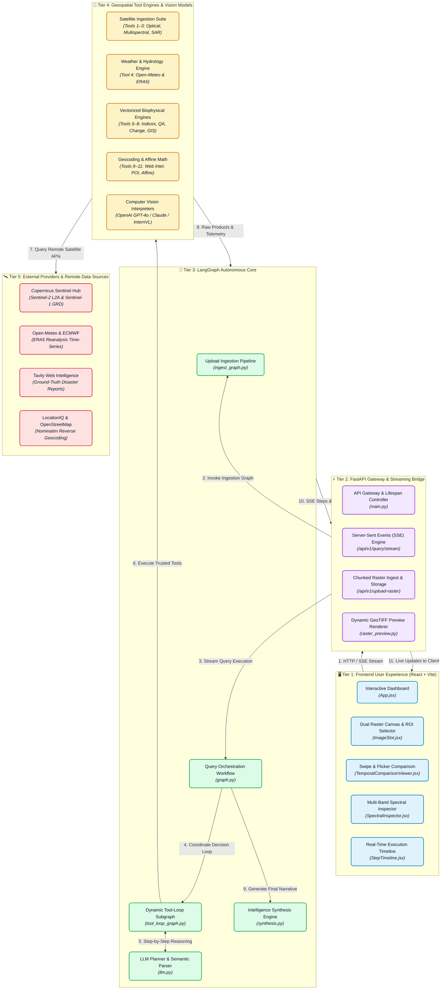

---

### 1.2 End-to-End Data Journey (Step-by-Step Flowchart)

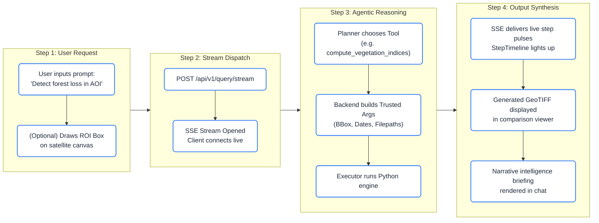

---

### 1.3 Core System Design Contracts

| Contract Principle | What It Does | Why It Matters | Implementation File |
| :--- | :--- | :--- | :--- |
| **Separation of Concerns** | Decouples satellite fetchers, offline numpy math, GIS engines, and web search. | Modular testing; offline engines run without internet or API keys. | [backend/tools/executor.py](file:///Users/shrishtigaur/Documents/SatQuery-main/backend/tools/executor.py) |
| **Anti-Hallucination Guard** | Models choose *what* tool to run, but backend supplies the real coordinates, file paths, and dates. | Eliminates fabricated bounding boxes and invalid filepaths. | [backend/orchestrator/registry.py](file:///Users/shrishtigaur/Documents/SatQuery-main/backend/orchestrator/registry.py) |
| **Deterministic Grounding** | Applies closed-form affine matrix math to project vision model pixels to real WGS84 lat/long. | Replaces approximate AI visual guesses with sub-millimeter geographic accuracy. | [Tool_11_deterministic_affine_markup](file:///Users/shrishtigaur/Documents/SatQuery-main/Tool_11_deterministic_affine_markup) |
| **The Handshake Protocol** | Continuous differential rasters ($\Delta = T_2 - T_1$) feed directly into discrete categorical GIS models. | Seamlessly answers: *"How many square kilometers of cropland were flooded?"* | [AGENT_WORKFLOW_AND_INTEGRATION_SPEC.md](file:///Users/shrishtigaur/Documents/SatQuery-main/AGENT_WORKFLOW_AND_INTEGRATION_SPEC.md) |
| **Ground Truth Precedence** | Real reverse-geocoded place names strictly override vision model guesses. | Guarantees place name correctness in final synthesized reports. | [backend/orchestrator/synthesis.py](file:///Users/shrishtigaur/Documents/SatQuery-main/backend/orchestrator/synthesis.py) |

---

## 2. Frontend Architecture (`frontend/`)

The frontend is an interactive geospatial analyst workbench built with **React 18** and **Vite**, styled using a bespoke **Vanilla CSS design system** ([index.css](file:///Users/shrishtigaur/Documents/SatQuery-main/frontend/src/index.css)).

### 2.1 Workspace Layout & Visual Organization

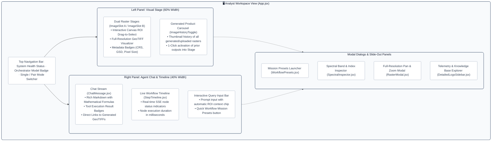

---

### 2.2 Mouse ROI Selection to Geographic Coordinate Flowchart

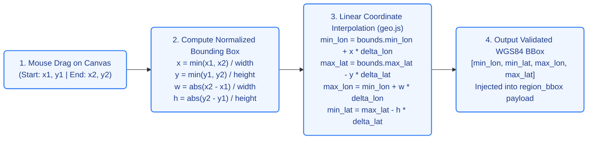

---

### 2.3 Key Frontend Components Reference

| Component | File Path | Visual Role | Key Interactive Features |
| :--- | :--- | :--- | :--- |
| **`ImageSlot`** | [ImageSlot.jsx](file:///Users/shrishtigaur/Documents/SatQuery-main/frontend/src/components/ImageSlot.jsx) | Primary satellite raster canvas | Interactive mouse ROI box drawing, metadata overlays, resolution badges. |
| **`TemporalComparisonViewer`** | [TemporalComparisonViewer.jsx](file:///Users/shrishtigaur/Documents/SatQuery-main/frontend/src/components/TemporalComparisonViewer.jsx) | Before/after comparison | Split-slider swipe view, side-by-side sync zoom, 500ms optical flicker mode. |
| **`SpectralInspector`** | [SpectralInspector.jsx](file:///Users/shrishtigaur/Documents/SatQuery-main/frontend/src/components/SpectralInspector.jsx) | Biophysical spectral analyzer | Multi-band value extraction, 13+ index breakdowns, canopy vigor charts. |
| **`StepTimeline`** | [StepTimeline.jsx](file:///Users/shrishtigaur/Documents/SatQuery-main/frontend/src/components/StepTimeline.jsx) | Live execution graph | Real-time node pulses driven by Server-Sent Events from the backend. |
| **`DetailedLogsSidebar`** | [DetailedLogsSidebar.jsx](file:///Users/shrishtigaur/Documents/SatQuery-main/frontend/src/components/DetailedLogsSidebar.jsx) | Telemetry & telemetry drawer | JSON tree inspection, tool execution timings, upload knowledge base audit. |
| **`WorkflowPresets`** | [WorkflowPresets.jsx](file:///Users/shrishtigaur/Documents/SatQuery-main/frontend/src/components/WorkflowPresets.jsx) | Mission quick-launcher | 1-click execution cards for Wildfire, Flood, Drought, and Deforestation. |

---

## 3. Backend Gateway Architecture (`backend/`)

The backend is built with **FastAPI** and acts as the secure, high-speed gateway between browser clients, satellite APIs, and the LangGraph engine.

### 3.1 Dynamic Raster Rendering Pipeline Flowchart

Satellite rasters are stored as 16-bit or 32-bit floating-point GeoTIFFs. The pipeline below dynamically converts them into optimized, high-contrast browser PNG previews:

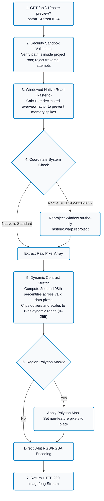

---

### 3.2 Vision Model (VLM) Interpretation Pipeline Flowchart

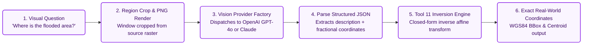

---

### 3.3 Backend API Endpoint Reference

| Method | Endpoint | Purpose | Key Parameters | Response Type |
| :--- | :--- | :--- | :--- | :--- |
| `POST` | `/api/v1/query/stream` | Primary streaming query route | `query`, `bbox`, `region_bbox`, `input_file` | Server-Sent Events (`text/event-stream`) |
| `POST` | `/api/v1/query` | Synchronous query execution | `query`, `bbox`, `start_date`, `end_date` | `application/json` (full execution summary) |
| `POST` | `/api/v1/upload-raster` | Ingests user GeoTIFF files | Multipart `file` (up to 500 MB) | `{"path": "...", "knowledge_base": {...}}` |
| `GET` | `/api/v1/raster-preview` | Renders contrast-stretched PNG | `path`, `size` (default: 1024px) | `image/png` |
| `GET` | `/api/v1/raster-file` | Downloads raw GeoTIFF raster | `path` | `application/octet-stream` |
| `GET` | `/api/v1/models` | Active model configuration | None | JSON status of orchestrator & vision models |
| `POST` | `/api/v1/conversation/reset` | Resets conversation session | `session_id`, `temp_files` | Deletes temporary uploads and clears context |

---

## 4. LangGraph Architecture & Graph Implementations

SatQuery separates raster preparation from query execution by employing **two distinct LangGraph graphs**:
1. **The Ingestion Graph** (`ingest_graph.py`): Runs once upon file upload to profile, validate, and build a local knowledge base.
2. **The Query Graph** (`graph.py`): Runs on every prompt to coordinate multi-hop tool execution.

### 4.1 Ingestion Graph Flowchart (Upload-Time Profiling)

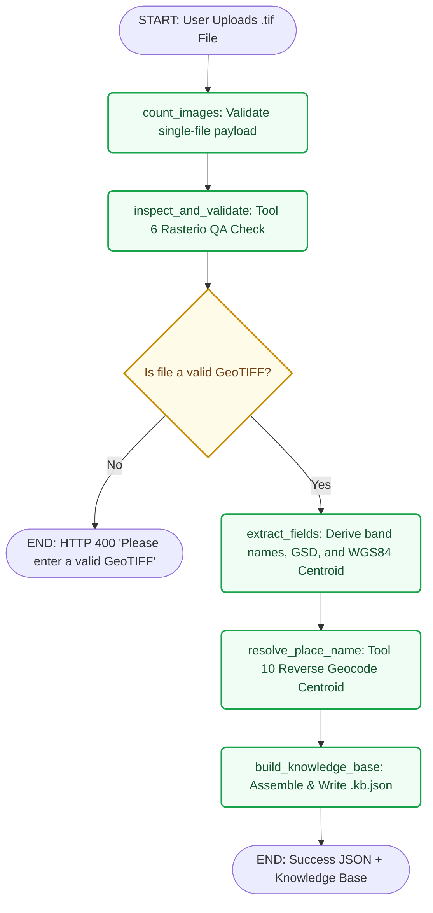

---

### 4.2 Query Graph Flowchart (Query-Time Multi-Hop Execution)

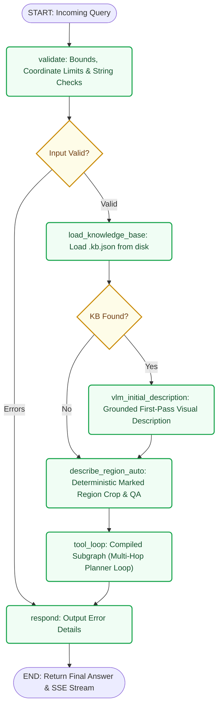

---

### 4.3 Subgraph Reducer Slicing Mechanics Flowchart

When the recursive `tool_loop_subgraph` completes, LangGraph's list reducers (`Annotated[list, add]`) could duplicate items if returned raw. The diagram below shows how `_tool_loop_node` prevents duplicates:

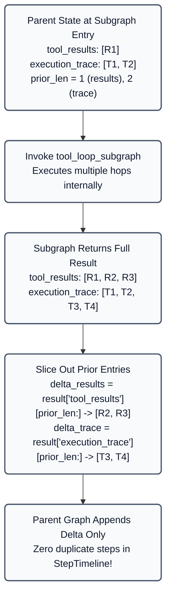

---

### 4.4 LangGraph State Dictionary (`SatQueryState`)

| State Field | Type | Lifecycle & Source | Consumer Nodes |
| :--- | :--- | :--- | :--- |
| **`query`** | `str` | User prompt from HTTP request | `validate`, `llm`, `synthesis` |
| **`bbox`** | `list[float]` | Request body or derived from Tool 6 inspection | Imagery fetch tools (Tools 1–3) |
| **`region_bbox`** | `list[float]` | Drawn on frontend canvas or located by VLM | `describe_region_auto`, Tool 11 |
| **`region_polygon`** | `list[dict]` | Feature boundary traced by VLM | Region masking, Tool 11 |
| **`region_centroid`** | `dict` | Computed path centroid of polygon | Anchor point for weather (Tool 4) & reverse geocoding |
| **`place_name`** | `str` | Extracted by LLM planner from prompt | Forward geocoding (Tool 10) |
| **`input_file`** | `str` | Uploaded raster or prior tool output path | Tools 5, 6, 8, vision tools |
| **`tool_results`** | `list[ToolResult]` | Appended by `tool_node` on every execution | Planner continuation context, `synthesis` |
| **`execution_trace`** | `list[TraceEntry]` | Appended by `trace_entry()` in every node | Real-time SSE stream, frontend `StepTimeline` |

---

## 5. Autonomous Orchestrator Architecture

The orchestrator is SatQuery's cognitive planner. It replaces legacy rigid intent classification with **autonomous multi-hop reasoning**, picking tools dynamically based on real-time evidence.

### 5.1 Autonomous Multi-Hop Decision Loop Flowchart

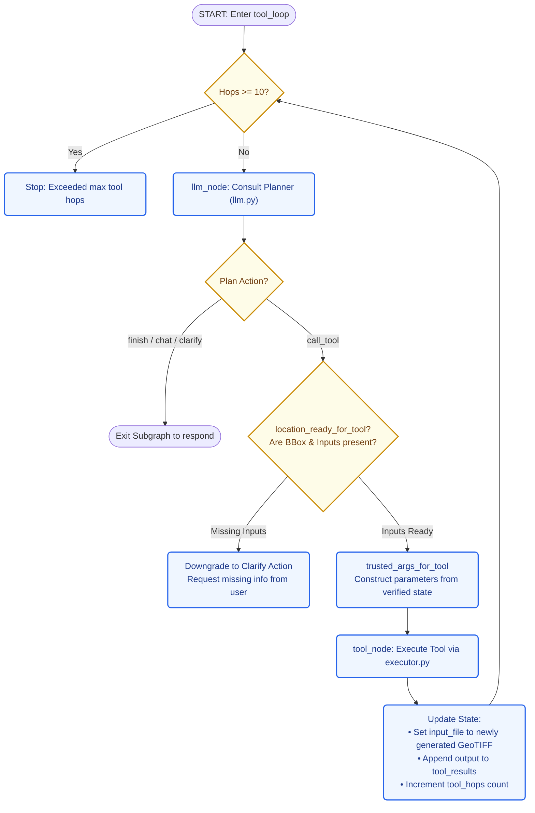

---

### 5.2 The Tool 7 $\rightarrow$ Tool 8 Analytical Handshake Flowchart

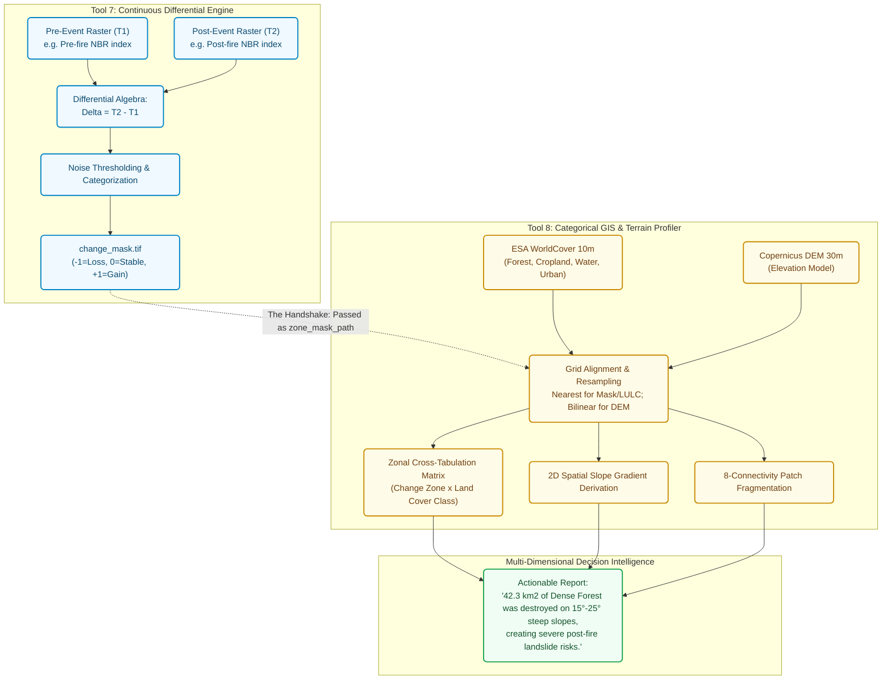

---

### 5.3 Ground Truth Precedence Hierarchy (Conflict Resolution)

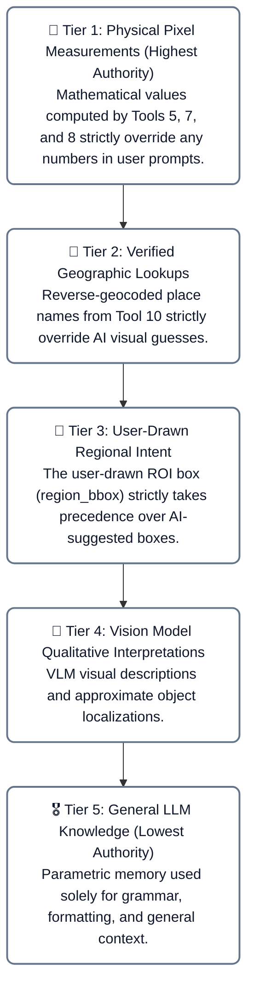

---

### 5.4 Autonomous Missions Reference Matrix (`satquery_workflows.py`)

| Mission Pipeline | Target Event | Step-by-Step Tool Sequence | Key Output Artifacts | Primary Metric |
| :--- | :--- | :--- | :--- | :--- |
| **Pipeline A: Wildfire Burn Severity** | Forest fires, burn scars, post-fire erosion risk | **Tool 5** (Pre/Post NBR) $\rightarrow$ **Tool 6** (QA) $\rightarrow$ **Tool 7** ($\Delta\text{NBR}$) $\rightarrow$ **Tool 8** (Zonal LULC & Slope) | `nbr_pre.tif`<br>`delta_nbr.tif`<br>`burn_severity.tif` | Destroyed forest area ($\text{km}^2$) and high-slope landslide risk exposure. |
| **Pipeline B: Radar Flood Inundation** | Cyclone flooding, monsoon inundation through cloud cover | **Tool 6** (QA) $\rightarrow$ **Tool 7** (SAR backscatter drop $\le -3\,\text{dB}$) $\rightarrow$ **Tool 4** (Rainfall check) $\rightarrow$ **Tool 8** (Flooded LULC) | `sar_diff.tif`<br>`flood_mask.tif` | Inundated cropland & urban infrastructure area ($\text{km}^2$). |
| **Pipeline C: Agricultural Drought** | Canopy dehydration, regional crop moisture stress | **Tool 5** (NDMI & NDVI) $\rightarrow$ **Tool 4** (ERA5 Soil Moisture Anomaly) $\rightarrow$ Statistical Correlation Engine | `ndmi_canopy.tif`<br>`ndvi_vigor.tif` | Soil-moisture-to-canopy deficit correlation index ($[-1.0, 1.0]$). |

---

## 6. Complete 11-Tool Ecosystem Matrix

| Tool ID | Name | Technology | Input Requirements | Generated Outputs |
| :---: | :--- | :--- | :--- | :--- |
| **Tool 1** | `fetch_optical_imagery` | Sentinel-2 L2A | Bounding Box, Date range, Max cloud % | True-Color RGB GeoTIFF + Cloud Quality JSON |
| **Tool 2** | `fetch_multispectral_imagery` | Sentinel-2 L2A | Bounding Box, Date range, Band list | 12-Band Surface Reflectance GeoTIFF + Band Mapping |
| **Tool 3** | `fetch_sar_imagery` | Sentinel-1 GRD | Bounding Box, Date range, Polarization | Cloud-penetrating Backscatter GeoTIFF (dB) |
| **Tool 4** | `fetch_weather_environment` | Open-Meteo & ERA5 | Bounding Box or Point, Date range | Weather time series, Moisture deficit, Drought stress |
| **Tool 5** | `compute_vegetation_indices` | Vectorized NumPy | Multi-band GeoTIFF, Index names | Multi-band Index GeoTIFF (FLOAT32) + Canopy Area |
| **Tool 6** | `inspect_geotiff_metadata` | Local Rasterio | GeoTIFF path, Optional compare path | Dimensions, CRS, GSD, NoData count, Grid compatibility |
| **Tool 7** | `analyze_temporal_change` | Differential Algebra | $T_1$ and $T_2$ GeoTIFFs, Thresholds | `difference_raster.tif`, `change_mask.tif` (-1, 0, +1) |
| **Tool 8** | `analyze_spatial_landcover_terrain` | WorldCover & DEM | LULC GeoTIFF, DEM, Zone Mask | Landcover composition, Patch fragmentation, Slope |
| **Tool 9** | `fetch_web_intelligence` | Tavily Search API | Query, Location hint | Verified ground-truth news & incident citations |
| **Tool 10**| `spatial_geocoding_poi` | LocationIQ / OSM | Place name, Lat/Lon, or BBox | Verified coordinates, Address, In-scene POI list |
| **Tool 11**| `deterministic_affine_markup` | Affine Math & Pillow | GeoTIFF path, Feature list | Subpixel projected coordinate markup on PNG preview |

---

## 7. Project Sitemap & Quick Links

```text
SatQuery Architecture Sitemap
├── 🖥️ Frontend (React 18 + Vite)
│   ├── Application Coordinator   → frontend/src/App.jsx
│   ├── Raster Canvas Stage       → frontend/src/components/ImageSlot.jsx
│   ├── Comparison Viewers       → frontend/src/components/TemporalComparisonViewer.jsx
│   ├── Spectral Inspector        → frontend/src/components/SpectralInspector.jsx
│   ├── Live Workflow Graph       → frontend/src/components/StepTimeline.jsx
│   ├── Mission Presets           → frontend/src/components/WorkflowPresets.jsx
│   └── Client Geo Library        → frontend/src/lib/geo.js
│
├── ⚡ Backend Gateway (FastAPI)
│   ├── Application Factory       → backend/main.py
│   ├── Runtime Settings          → backend/config/settings.py
│   ├── Query & SSE Routes        → backend/api/routes/query.py
│   ├── Upload Handling Routes    → backend/api/routes/uploads.py
│   ├── Preview Renderer          → backend/rendering/raster_preview.py
│   └── Tool Execution Gateway    → backend/tools/executor.py
│
├── 🧠 LangGraph Orchestrator
│   ├── Shared State Definition   → backend/orchestrator/state.py
│   ├── Query Graph Workflow      → backend/orchestrator/graph.py
│   ├── Ingestion Graph Workflow  → backend/orchestrator/ingest_graph.py
│   ├── Tool-Loop Subgraph        → backend/orchestrator/tool_loop_graph.py
│   ├── Tool Registry & Schemas   → backend/orchestrator/registry.py
│   ├── LLM Planner Engine        → backend/orchestrator/llm.py
│   └── Intelligence Synthesis    → backend/orchestrator/synthesis.py
│
└── 🔬 Scientific Tools (Tools 1–11)
    ├── Optical & Multispectral   → Tool_1_... / Tool_2_...
    ├── SAR Radar & Weather       → Tool_3_... / Tool_4_...
    ├── Biophysical Math & GIS    → Tool_5_... / Tool_6_... / Tool_7_... / Tool_8_...
    ├── Geocoding & Affine Math   → Tool_9_... / Tool_10_... / Tool_11_...
    └── Autonomous Missions       → satquery_workflows.py
```
